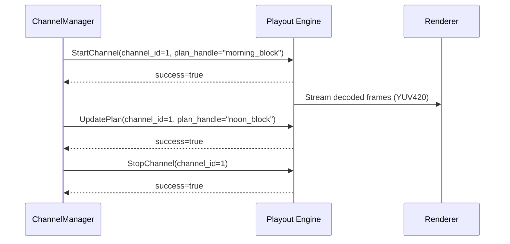

# Playout Contract

_Related: [Playout Engine Domain](../domain/PlayoutEngineDomain.md) • [Proto Schema](../../proto/retrovue/playout.proto) • [Architecture Overview](../architecture/ArchitectureOverview.md)_

---

## Purpose

This document defines the **control-plane contract** between the RetroVue Python runtime (`ChannelManager`) and the native C++ playout engine.  
It details the gRPC service, request/response semantics, state guarantees, and versioning rules governing both systems.

---

## API Overview

The playout engine implements a single gRPC service defined in [`proto/retrovue/playout.proto`](../../proto/retrovue/playout.proto):

```proto
service PlayoutControl {
  rpc StartChannel(StartChannelRequest) returns (StartChannelResponse);
  rpc UpdatePlan(UpdatePlanRequest) returns (UpdatePlanResponse);
  rpc StopChannel(StopChannelRequest) returns (StopChannelResponse);
}
```

> **Note:**  
> Each method manages a specific channel lifecycle operation and **must be idempotent**.

---

### Message Definitions

#### **StartChannel**

**Purpose:**  
Boot a new playout worker for a channel and begin decoding from the provided playout plan.

**Request**

| Field         | Type   | Description                                        |
| ------------- | ------ | -------------------------------------------------- |
| `channel_id`  | int32  | Unique numeric identifier for the channel          |
| `plan_handle` | string | Opaque reference to a serialized playout plan      |
| `port`        | int32  | Port number where the Renderer will consume output |

**Response**

| Field           | Type   | Description                              |
| --------------- | ------ | ---------------------------------------- |
| `success`       | bool   | Indicates whether startup succeeded      |
| `error_message` | string | (optional) Human-readable failure reason |

**Behavior:**

- Allocate decode threads, initialize ring buffer, and transition channel state to `ready`.
- On failure, emit `retrovue_playout_channel_state{channel="N"} = "error"` and return `success=false`.

---

#### **UpdatePlan**

**Purpose:**  
Hot-swap the currently running playout plan without restarting the worker.

**Request**

| Field         | Type   | Description                |
| ------------- | ------ | -------------------------- |
| `channel_id`  | int32  | Existing channel worker ID |
| `plan_handle` | string | New playout plan reference |

**Response**

| Field           | Type   | Description                                 |
| --------------- | ------ | ------------------------------------------- |
| `success`       | bool   | True if swap completed successfully         |
| `error_message` | string | (optional) Diagnostic text if update failed |

**Behavior:**

- Drain the current decode queue.
- Reload asset map and resume decoding from the next valid timestamp.
- _Expected downtime: ≤ 500 ms._

---

#### **StopChannel**

**Purpose:**  
Gracefully shut down an active channel worker.

**Request**

| Field        | Type  | Description                |
| ------------ | ----- | -------------------------- |
| `channel_id` | int32 | Channel identifier to stop |

**Response**

| Field           | Type   | Description                                |
| --------------- | ------ | ------------------------------------------ |
| `success`       | bool   | True if teardown completed cleanly         |
| `error_message` | string | (optional) Description if failure occurred |

**Behavior:**

- Flush frame queue, stop decode threads, release all `libav*` resources.
- Set channel state as `retrovue_playout_channel_state{channel="N"} = "stopped"`.

---

## Telemetry Expectations

The playout engine **must** expose Prometheus metrics at `/metrics`:

| Metric                                    | Type  | Description                                         |
| ----------------------------------------- | ----- | --------------------------------------------------- |
| `retrovue_playout_channel_state{channel}` | Gauge | Reports `ready`, `buffering`, `error`, or `stopped` |
| `retrovue_playout_frame_gap_seconds`      | Gauge | Deviation from scheduled MasterClock timestamps     |
| `retrovue_playout_buffer_depth_frames`    | Gauge | Number of frames currently staged per channel       |

---

## Versioning Rules

- API versioning is governed by the `PLAYOUT_API_VERSION` constant in the proto file options.
- Any **backward-incompatible** change (field removal, name/semantic changes, etc.) **must** bump this version and require synchronized releases of:
  - `retrovue-core`
  - `retrovue-playout`

---

## Error Handling

- All methods return a `success` flag and an optional `error_message`.
- **Critical errors** (decoder crash, invalid plan):
  - Set channel state to `error`.
  - Attempt restart up to **5 times per minute** with exponential backoff.
  - If recovery fails, fall back to slate output and notify ChannelManager via health metric.

---

## Example Lifecycle



---

## See Also

- [Architecture Overview](../architecture/ArchitectureOverview.md)
- [Runtime Model](../runtime/PlayoutRuntime.md)
- [Proto schema](../../proto/retrovue/playout.proto)
