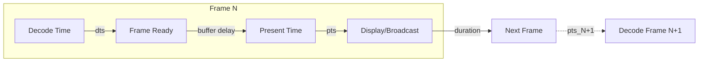

_Related: [Architecture Overview](../architecture/ArchitectureOverview.md) • [Playout Domain Contract](PlayoutDomainContract.md) • [Runtime Model](../runtime/PlayoutRuntime.md) • [Development Standards](../development-standards.md)_

# Domain — Metrics and Timing Contract

Status: Enforced

## Purpose

This document defines the **time and telemetry contract** for the RetroVue Playout Engine. It establishes how all subsystems synchronize to a unified wall clock, how frame timing metadata (PTS/DTS/duration) flows through the decode-buffer-render pipeline, and what telemetry schema is exposed for operational monitoring.

The timing contract ensures:

1. **Clock Unity**: All channels share a single source of truth for "now" via MasterClock
2. **Frame Synchronization**: Producers, buffers, and renderers coordinate frame delivery using consistent timing metadata
3. **Observable Behavior**: All timing deviations, buffer health, and decode performance are captured in Prometheus metrics
4. **Deterministic Testing**: Timing accuracy and metrics correctness are validated under load

Without this contract, channels would drift out of sync, frames would be delivered at incorrect times, and operational visibility would be compromised.

---

## MasterClock Specification

### Overview

**MasterClock** is the single source of truth for time across the RetroVue runtime. The playout engine consumes MasterClock to:

- Align frame PTS with scheduled broadcast time
- Calculate timing deviations (`frame_gap_seconds`)
- Determine when to pull frames from buffers
- Compute channel uptime telemetry

### Interface

```cpp
class MasterClock {
public:
    virtual ~MasterClock() = default;

    // Get current UTC time (microseconds since Unix epoch)
    virtual int64_t now_utc_us() const = 0;

    // Get current local time (microseconds since Unix epoch)
    virtual int64_t now_local_us() const = 0;

    // Convert UTC timestamp to local time
    virtual int64_t to_local(int64_t utc_us) const = 0;

    // Calculate offset between current time and scheduled PTS
    // Returns: positive if frame is ahead of schedule, negative if late
    virtual int64_t offset_from_schedule(int64_t scheduled_pts_us) const = 0;

    // Get clock frequency (Hz)
    virtual int64_t frequency() const = 0;
};
```

### Behavioral Guarantees

| Guarantee          | Specification                                                                 |
| ------------------ | ----------------------------------------------------------------------------- |
| **Monotonicity**   | `now_utc_us()` never returns a value less than a previous call                |
| **Precision**      | Microsecond resolution (±1 µs)                                                |
| **Accuracy**       | Synchronized to system clock within ±50ms                                     |
| **Thread Safety**  | All methods are thread-safe and lock-free                                     |
| **Performance**    | `now_utc_us()` completes in ≤ 100ns (no syscalls in hot path)                |
| **Timezone Aware** | UTC and local times correctly account for timezone and DST                    |
| **No Leap Back**   | Clock adjustments (NTP sync) never cause time to go backward (smooth slewing) |

### Usage Rules

**DO**:

- Use `now_utc_us()` for all frame timing calculations
- Use `offset_from_schedule()` to compute `frame_gap_seconds` metric
- Use `now_local_us()` for logging and user-facing timestamps

**DON'T**:

- Call system time functions directly (`gettimeofday()`, `clock_gettime()`, `std::chrono::system_clock::now()`)
- Cache MasterClock results across frames (always query fresh)
- Use `std::this_thread::sleep_for()` for timing (use MasterClock-based sleep)

### Drift Tolerance

The playout engine monitors clock drift between MasterClock and expected frame intervals:

| Drift Amount       | Action                                                |
| ------------------ | ----------------------------------------------------- |
| ≤ 16.67ms          | Normal operation (within one frame @ 60fps)           |
| 16.67ms - 100ms    | Log warning, increment `clock_drift_warning_total`    |
| 100ms - 1s         | Log error, consider buffer adjustment                 |
| \> 1s              | Transition channel to `error`, emit alert             |

### Clock Source

**Production**: MasterClock is provided by the RetroVue runtime and synchronized to NTP.

**Testing**: Mock implementation returns deterministic timestamps for reproducible tests.

```cpp
// Test mock
class MockMasterClock : public MasterClock {
    int64_t fake_time_us_ = 1672531200000000; // 2023-01-01 00:00:00 UTC

    int64_t now_utc_us() const override {
        return fake_time_us_;
    }

    void advance(int64_t delta_us) {
        fake_time_us_ += delta_us;
    }
};
```

---

## Frame Timing Model

### Timing Metadata

Every decoded frame carries three timing values:

```cpp
struct FrameMetadata {
    int64_t pts;        // Presentation timestamp (microseconds)
    int64_t dts;        // Decode timestamp (microseconds)
    double duration;    // Frame duration (seconds)
    // ... other fields
};
```

**Definitions**:

| Field      | Meaning                                              | Source                    | Range               |
| ---------- | ---------------------------------------------------- | ------------------------- | ------------------- |
| `pts`      | When frame should be displayed/broadcast             | FFmpeg `AVFrame->pts`     | Microseconds (int64) |
| `dts`      | When frame was/should be decoded                     | FFmpeg `AVPacket->dts`    | Microseconds (int64) |
| `duration` | How long frame is displayed (1/fps)                  | Computed or stream metadata | Seconds (double)    |

### Timing Relationships



**Invariants**:

1. **DTS ≤ PTS**: Frames must be decoded before they can be presented
   - Exception: B-frames in H.264/HEVC may have DTS > PTS
   - Producer must reorder frames to ensure PTS monotonicity

2. **PTS Monotonicity**: Within a single asset stream, `pts_N+1 > pts_N`
   - Duplicate PTS → skip frame, log warning
   - Decreasing PTS → log error, transition to `error`
   - Exception: PTS may reset when transitioning between assets

3. **Duration Consistency**: `pts_N+1 ≈ pts_N + duration_N`
   - Tolerance: ±1ms (account for rounding)
   - VFR (variable frame rate) content may have varying durations

### Synchronization Model

The playout engine maintains synchronization at three stages:

#### 1. Producer → Buffer (Decode Stage)

**Timing Source**: Asset stream metadata

**Process**:
1. Producer reads packet from media file
2. Decode packet to frame
3. Extract PTS, DTS, duration from FFmpeg
4. Validate: DTS ≤ PTS, PTS > previous PTS
5. Push frame + metadata to buffer

**Metrics Updated**:
- `retrovue_playout_decode_latency_seconds` (DTS to push completion)
- `retrovue_playout_frames_decoded_total`

#### 2. Buffer Stage (Storage)

**Timing Source**: Frame metadata (passive)

**Process**:
1. Buffer stores frames in arrival order
2. No timing validation (producer ensures correctness)
3. Buffer depth tracked as count, not duration

**Metrics Updated**:
- `retrovue_playout_buffer_depth_frames`

#### 3. Buffer → Renderer (Presentation Stage)

**Timing Source**: MasterClock

**Process**:
1. Renderer queries MasterClock: `now = now_utc_us()`
2. Peek next frame from buffer
3. Calculate gap: `gap = frame.pts - now`
4. If `gap ≤ 0`: Pull frame, render immediately
5. If `gap > 0`: Sleep until `now + gap`, then pull

**Metrics Updated**:
- `retrovue_playout_frame_gap_seconds`
- `retrovue_playout_frames_rendered_total`

### Timing Diagram (Nominal Case)

```
Time (ms)  Producer           Buffer                 Renderer           MasterClock
─────────────────────────────────────────────────────────────────────────────────────
   0       Decode F1          
          (PTS=1000)
   8                          [F1]                                      now = 970
  16       Decode F2          [F1, F2]                                 now = 985
         (PTS=1033)
  24       Decode F3          [F1, F2, F3]                             now = 1000
         (PTS=1066)                                Pull F1 ──────────> (gap = 0ms)
  32                          [F2, F3]              Render F1          now = 1015
  33                                                (16.67ms)
  40       Decode F4          [F2, F3, F4]                             now = 1033
         (PTS=1100)                                Pull F2 ──────────> (gap = 0ms)
  48                          [F3, F4]              Render F2          now = 1050
```

**Key Observations**:

- Producer runs ahead of renderer (buffer depth: 2-3 frames)
- Frame gap remains ≤ 16ms (one frame duration)
- Decode latency: ~8ms per frame (well under 25ms target)

---

## Renderer Synchronization Rules

### Frame Pull Timing

Renderers must implement the following algorithm:

```cpp
bool FrameRenderer::pull_frame(int channel_id, Frame& out_frame) {
    // 1. Peek next frame without removing from buffer
    Frame* next = buffer_.peek();
    if (!next) {
        metrics_.increment_buffer_underrun(channel_id);
        return false;  // Buffer empty
    }

    // 2. Check if frame is due for presentation
    int64_t now = clock_.now_utc_us();
    int64_t gap_us = next->metadata.pts - now;

    // 3. Frame is late (negative gap) - render immediately
    if (gap_us < 0) {
        metrics_.record_frame_gap(channel_id, gap_us / 1e6);
        buffer_.pop(out_frame);
        return true;
    }

    // 4. Frame is early (positive gap) - check tolerance
    if (gap_us > EARLY_THRESHOLD_US) {
        return false;  // Not yet time to render
    }

    // 5. Frame is within tolerance - render now
    metrics_.record_frame_gap(channel_id, gap_us / 1e6);
    buffer_.pop(out_frame);
    return true;
}
```

**Constants**:

```cpp
constexpr int64_t EARLY_THRESHOLD_US = 8000;  // 8ms (half frame @ 60fps)
constexpr int64_t LATE_THRESHOLD_US = 50000;  // 50ms (3 frames @ 60fps)
```

### Early Frame Handling

**Scenario**: Renderer attempts to pull frame but `frame.pts > now + EARLY_THRESHOLD_US`

**Actions**:

1. Return `false` (do not pull frame)
2. Do **not** increment underrun counter (buffer is healthy)
3. Sleep for `(frame.pts - now) / 2` microseconds
4. Retry pull on next iteration

**Rationale**: Prevents "pulling too early" which would deplete buffer unnecessarily.

### Late Frame Handling

**Scenario**: Renderer pulls frame where `frame.pts < now - LATE_THRESHOLD_US`

**Actions**:

1. Pull and render frame immediately (no delay)
2. Log warning: `"Frame late by {gap}ms on channel {id}"`
3. Increment `retrovue_playout_frames_late_total`
4. Record negative gap in `retrovue_playout_frame_gap_seconds` metric

**Thresholds**:

| Lateness       | Severity | Action                                       |
| -------------- | -------- | -------------------------------------------- |
| 0 - 50ms       | INFO     | Log, continue                                |
| 50ms - 500ms   | WARNING  | Log, increment late counter                  |
| 500ms - 5s     | ERROR    | Log, increment late counter, alert operator  |
| \> 5s          | CRITICAL | Transition channel to `error`, inject slate  |

### Buffer Underrun Handling

**Scenario**: Renderer attempts to pull frame but buffer is empty

**Actions**:

1. Return `false` from `pull_frame()`
2. Increment `retrovue_playout_buffer_underrun_total`
3. Transition channel to `buffering` state
4. Inject slate frame to maintain output continuity
5. Wait for buffer to refill to minimum depth (30 frames)
6. Transition back to `ready` state

**Slate Injection**:

```cpp
Frame generate_slate_frame(int channel_id, int64_t pts) {
    Frame slate;
    slate.data = load_slate_image();  // Static YUV420 buffer
    slate.metadata.pts = pts;
    slate.metadata.dts = pts;
    slate.metadata.duration = 1.0 / 30.0;  // 30fps slate
    slate.metadata.asset_uri = "slate://technical_difficulties";
    return slate;
}
```

**Slate Timing**:

- Slate frames use synthetic PTS incremented by 33.33ms (30fps)
- Slate duration continues until buffer refills or channel stops
- Slate frames **are** counted in `frames_rendered_total`
- Slate frames **are not** counted in `frames_decoded_total`

### Buffer Overflow Handling

**Scenario**: Producer attempts to push frame but buffer is full

**Actions**:

1. Drop incoming frame (do not push)
2. Increment `retrovue_playout_frames_dropped_total`
3. Log warning: `"Buffer full, dropped frame PTS={pts} on channel {id}"`
4. Continue decode (do not pause producer)

**Prevention**:

- Renderer must maintain consumption rate ≥ decode rate
- Target buffer depth: 30-60 frames (healthy range)
- If depth consistently exceeds 55 frames, log warning

---

## Prometheus Telemetry Schema

### Core Metrics

| Metric Name                                      | Type      | Labels                 | Unit       | Description                                               |
| ------------------------------------------------ | --------- | ---------------------- | ---------- | --------------------------------------------------------- |
| `retrovue_playout_channel_state`                 | Gauge     | `channel`              | enum       | Current state: 0=stopped, 1=buffering, 2=ready, 3=error   |
| `retrovue_playout_buffer_depth_frames`           | Gauge     | `channel`              | frames     | Number of frames in ring buffer                           |
| `retrovue_playout_channel_fps`                   | Gauge     | `channel`              | fps        | Actual rendering frame rate (1-second sliding window)     |
| `retrovue_playout_frame_gap_seconds`             | Gauge     | `channel`              | seconds    | PTS deviation from MasterClock (positive=early, negative=late) |
| `retrovue_playout_frame_delay_ms`                | Gauge     | `channel`              | ms         | Alias for `frame_gap_seconds * 1000` (legacy compat)      |
| `retrovue_playout_decode_error_total`            | Counter   | `channel`, `error_type` | count      | Total decode errors by type                               |
| `retrovue_playout_frames_decoded_total`          | Counter   | `channel`              | frames     | Total frames successfully decoded                         |
| `retrovue_playout_frames_rendered_total`         | Counter   | `channel`              | frames     | Total frames rendered (including slate)                   |
| `retrovue_playout_frames_dropped_total`          | Counter   | `channel`              | frames     | Frames dropped due to buffer overflow                     |
| `retrovue_playout_frames_late_total`             | Counter   | `channel`              | frames     | Frames rendered more than 50ms late                       |
| `retrovue_playout_buffer_underrun_total`         | Counter   | `channel`              | count      | Number of buffer underrun events                          |
| `retrovue_playout_buffer_overflow_total`         | Counter   | `channel`              | count      | Number of buffer overflow events                          |
| `retrovue_playout_decode_latency_seconds`        | Histogram | `channel`              | seconds    | Time from packet read to frame ready                      |
| `retrovue_playout_render_latency_seconds`        | Histogram | `channel`              | seconds    | Time from pull to render complete                         |
| `retrovue_playout_channel_uptime_seconds`        | Gauge     | `channel`              | seconds    | Time since channel entered `ready` state                  |
| `retrovue_playout_clock_drift_seconds`           | Gauge     | `channel`              | seconds    | Observed drift between MasterClock and expected intervals |
| `retrovue_playout_clock_drift_warning_total`     | Counter   | `channel`              | count      | Number of times drift exceeded warning threshold          |
| `retrovue_playout_asset_transitions_total`       | Counter   | `channel`              | count      | Number of asset boundary transitions                      |
| `retrovue_playout_plan_updates_total`            | Counter   | `channel`              | count      | Number of `UpdatePlan` operations                         |

### Error Type Labels

The `decode_error_total` metric uses the following `error_type` labels:

| Error Type             | Description                                    |
| ---------------------- | ---------------------------------------------- |
| `corrupt_packet`       | FFmpeg could not decode packet (corrupt data)  |
| `unsupported_codec`    | Codec not supported by FFmpeg build            |
| `asset_not_found`      | File path in plan does not exist               |
| `io_error`             | Disk read failure                              |
| `memory_allocation`    | Failed to allocate frame buffer                |
| `pts_regression`       | PTS decreased or duplicated                    |
| `timeout`              | Decode operation timed out (>5s)               |

### Metric Update Frequency

| Metric Type       | Update Frequency                         | Implementation                        |
| ----------------- | ---------------------------------------- | ------------------------------------- |
| Gauge (state)     | Immediate on state change                | Atomic store                          |
| Gauge (buffer)    | On every push/pop                        | Atomic increment/decrement            |
| Gauge (fps)       | Every 100ms (10 Hz)                      | Sliding window average                |
| Gauge (gap)       | On every frame render                    | Atomic store                          |
| Counter           | On every event                           | Atomic increment                      |
| Histogram         | On every sampled operation               | Lock-free histogram buckets           |

### Histogram Buckets

**Decode Latency**:

```
buckets: [0.001, 0.005, 0.010, 0.025, 0.050, 0.100, 0.250, 0.500, 1.0, +Inf]
units: seconds
```

**Render Latency**:

```
buckets: [0.0001, 0.0005, 0.001, 0.005, 0.010, 0.025, 0.050, +Inf]
units: seconds
```

---

## HTTP Endpoint Contract

### Endpoint Specification

**URL**: `http://localhost:9090/metrics`

**Method**: `GET`

**Response Format**: Prometheus text exposition format (UTF-8)

**Content-Type**: `text/plain; version=0.0.4; charset=utf-8`

**Response Time**: ≤ 100ms (99th percentile)

**Availability**: Endpoint must respond even if all channels are stopped

### Sample Output

```prometheus
# HELP retrovue_playout_channel_state Current state of playout channel
# TYPE retrovue_playout_channel_state gauge
retrovue_playout_channel_state{channel="1"} 2
retrovue_playout_channel_state{channel="2"} 2

# HELP retrovue_playout_buffer_depth_frames Number of frames in staging buffer
# TYPE retrovue_playout_buffer_depth_frames gauge
retrovue_playout_buffer_depth_frames{channel="1"} 45
retrovue_playout_buffer_depth_frames{channel="2"} 38

# HELP retrovue_playout_channel_fps Actual rendering frame rate
# TYPE retrovue_playout_channel_fps gauge
retrovue_playout_channel_fps{channel="1"} 29.97
retrovue_playout_channel_fps{channel="2"} 30.00

# HELP retrovue_playout_frame_gap_seconds PTS deviation from MasterClock
# TYPE retrovue_playout_frame_gap_seconds gauge
retrovue_playout_frame_gap_seconds{channel="1"} 0.003
retrovue_playout_frame_gap_seconds{channel="2"} -0.008

# HELP retrovue_playout_frame_delay_ms Frame presentation delay in milliseconds
# TYPE retrovue_playout_frame_delay_ms gauge
retrovue_playout_frame_delay_ms{channel="1"} 3.0
retrovue_playout_frame_delay_ms{channel="2"} -8.0

# HELP retrovue_playout_decode_error_total Total decode errors by type
# TYPE retrovue_playout_decode_error_total counter
retrovue_playout_decode_error_total{channel="1",error_type="corrupt_packet"} 0
retrovue_playout_decode_error_total{channel="1",error_type="io_error"} 0
retrovue_playout_decode_error_total{channel="2",error_type="corrupt_packet"} 2

# HELP retrovue_playout_frames_decoded_total Total frames successfully decoded
# TYPE retrovue_playout_frames_decoded_total counter
retrovue_playout_frames_decoded_total{channel="1"} 45230
retrovue_playout_frames_decoded_total{channel="2"} 38910

# HELP retrovue_playout_frames_rendered_total Total frames rendered
# TYPE retrovue_playout_frames_rendered_total counter
retrovue_playout_frames_rendered_total{channel="1"} 45230
retrovue_playout_frames_rendered_total{channel="2"} 38910

# HELP retrovue_playout_frames_dropped_total Frames dropped due to overflow
# TYPE retrovue_playout_frames_dropped_total counter
retrovue_playout_frames_dropped_total{channel="1"} 0
retrovue_playout_frames_dropped_total{channel="2"} 0

# HELP retrovue_playout_frames_late_total Frames rendered late (>50ms)
# TYPE retrovue_playout_frames_late_total counter
retrovue_playout_frames_late_total{channel="1"} 5
retrovue_playout_frames_late_total{channel="2"} 12

# HELP retrovue_playout_buffer_underrun_total Buffer underrun events
# TYPE retrovue_playout_buffer_underrun_total counter
retrovue_playout_buffer_underrun_total{channel="1"} 0
retrovue_playout_buffer_underrun_total{channel="2"} 1

# HELP retrovue_playout_buffer_overflow_total Buffer overflow events
# TYPE retrovue_playout_buffer_overflow_total counter
retrovue_playout_buffer_overflow_total{channel="1"} 0
retrovue_playout_buffer_overflow_total{channel="2"} 0

# HELP retrovue_playout_decode_latency_seconds Decode latency distribution
# TYPE retrovue_playout_decode_latency_seconds histogram
retrovue_playout_decode_latency_seconds_bucket{channel="1",le="0.001"} 120
retrovue_playout_decode_latency_seconds_bucket{channel="1",le="0.005"} 8500
retrovue_playout_decode_latency_seconds_bucket{channel="1",le="0.010"} 42100
retrovue_playout_decode_latency_seconds_bucket{channel="1",le="0.025"} 45150
retrovue_playout_decode_latency_seconds_bucket{channel="1",le="0.050"} 45220
retrovue_playout_decode_latency_seconds_bucket{channel="1",le="0.100"} 45230
retrovue_playout_decode_latency_seconds_bucket{channel="1",le="0.250"} 45230
retrovue_playout_decode_latency_seconds_bucket{channel="1",le="0.500"} 45230
retrovue_playout_decode_latency_seconds_bucket{channel="1",le="1.0"} 45230
retrovue_playout_decode_latency_seconds_bucket{channel="1",le="+Inf"} 45230
retrovue_playout_decode_latency_seconds_sum{channel="1"} 523.45
retrovue_playout_decode_latency_seconds_count{channel="1"} 45230

# HELP retrovue_playout_render_latency_seconds Render latency distribution
# TYPE retrovue_playout_render_latency_seconds histogram
retrovue_playout_render_latency_seconds_bucket{channel="1",le="0.0001"} 0
retrovue_playout_render_latency_seconds_bucket{channel="1",le="0.0005"} 3200
retrovue_playout_render_latency_seconds_bucket{channel="1",le="0.001"} 42000
retrovue_playout_render_latency_seconds_bucket{channel="1",le="0.005"} 45200
retrovue_playout_render_latency_seconds_bucket{channel="1",le="0.010"} 45230
retrovue_playout_render_latency_seconds_bucket{channel="1",le="0.025"} 45230
retrovue_playout_render_latency_seconds_bucket{channel="1",le="0.050"} 45230
retrovue_playout_render_latency_seconds_bucket{channel="1",le="+Inf"} 45230
retrovue_playout_render_latency_seconds_sum{channel="1"} 34.12
retrovue_playout_render_latency_seconds_count{channel="1"} 45230

# HELP retrovue_playout_channel_uptime_seconds Time since channel ready
# TYPE retrovue_playout_channel_uptime_seconds gauge
retrovue_playout_channel_uptime_seconds{channel="1"} 1507.83
retrovue_playout_channel_uptime_seconds{channel="2"} 1297.45

# HELP retrovue_playout_clock_drift_seconds Observed clock drift
# TYPE retrovue_playout_clock_drift_seconds gauge
retrovue_playout_clock_drift_seconds{channel="1"} 0.000015
retrovue_playout_clock_drift_seconds{channel="2"} -0.000023

# HELP retrovue_playout_clock_drift_warning_total Clock drift warnings
# TYPE retrovue_playout_clock_drift_warning_total counter
retrovue_playout_clock_drift_warning_total{channel="1"} 0
retrovue_playout_clock_drift_warning_total{channel="2"} 0

# HELP retrovue_playout_asset_transitions_total Asset boundary crossings
# TYPE retrovue_playout_asset_transitions_total counter
retrovue_playout_asset_transitions_total{channel="1"} 18
retrovue_playout_asset_transitions_total{channel="2"} 15

# HELP retrovue_playout_plan_updates_total UpdatePlan operations
# TYPE retrovue_playout_plan_updates_total counter
retrovue_playout_plan_updates_total{channel="1"} 3
retrovue_playout_plan_updates_total{channel="2"} 2
```

### Error Responses

**Endpoint Not Ready** (startup phase):

```http
HTTP/1.1 503 Service Unavailable
Content-Type: text/plain

Metrics endpoint initializing
```

**Internal Error**:

```http
HTTP/1.1 500 Internal Server Error
Content-Type: text/plain

Error collecting metrics: [error message]
```

### Prometheus Scrape Configuration

**Recommended scrape interval**: 10 seconds

**Example `prometheus.yml`**:

```yaml
scrape_configs:
  - job_name: 'retrovue-playout'
    static_configs:
      - targets: ['localhost:9090']
    scrape_interval: 10s
    scrape_timeout: 5s
    metrics_path: /metrics
```

---

## Testing Expectations

### Metrics Accuracy Validation

**Test**: Verify counter increments match actual events

**Procedure**:

1. Start channel with known test asset (300 frames, 10 seconds @ 30fps)
2. Render all frames to completion
3. Stop channel
4. Query metrics endpoint
5. Assert:
   - `frames_decoded_total{channel="1"}` == 300
   - `frames_rendered_total{channel="1"}` == 300
   - `frames_dropped_total{channel="1"}` == 0
   - `decode_error_total{channel="1"}` == 0

**Pass Criteria**: All counters match expected values exactly (no tolerance).

---

### Timing Drift Under Load

**Test**: Verify frame gap remains within tolerance under sustained decode

**Procedure**:

1. Start 4 channels simultaneously
2. Decode H.264 1080p30 content for 60 seconds
3. Sample `frame_gap_seconds` every 100ms (600 samples per channel)
4. Assert:
   - p50 (median): ≤ 8ms
   - p95: ≤ 16ms
   - p99: ≤ 25ms
   - max: ≤ 50ms

**Pass Criteria**: 95% of samples meet p95 target across all channels.

---

### Clock Drift Detection

**Test**: Verify playout engine detects and reports MasterClock drift

**Procedure**:

1. Start channel with MockMasterClock
2. Advance mock clock at 1.05x speed (5% fast)
3. Decode 1000 frames
4. Assert:
   - `clock_drift_seconds` > 0 (positive drift)
   - `clock_drift_warning_total` > 0 (warnings triggered)

**Pass Criteria**: Drift is detected and reported within 10 seconds.

---

### Buffer Underrun Recovery

**Test**: Verify metrics correctly reflect underrun and recovery

**Procedure**:

1. Start channel with small buffer (10 frames)
2. Pause producer for 500ms (force underrun)
3. Resume producer
4. Wait for buffer to refill
5. Assert:
   - `buffer_underrun_total` incremented by 1
   - `channel_state` transitions: 2 (ready) → 1 (buffering) → 2 (ready)
   - `frames_rendered_total` includes slate frames

**Pass Criteria**: State transitions are captured in metrics timeline.

---

### Metrics Endpoint Performance

**Test**: Verify `/metrics` responds within latency target under load

**Procedure**:

1. Start 4 channels (steady state decode)
2. Issue 100 concurrent HTTP GET requests to `/metrics`
3. Measure response times
4. Assert:
   - p50: ≤ 10ms
   - p95: ≤ 50ms
   - p99: ≤ 100ms
   - No 5xx errors

**Pass Criteria**: 99% of requests meet p99 target.

---

### Histogram Accuracy

**Test**: Verify histogram buckets correctly categorize latencies

**Procedure**:

1. Start channel and decode 10,000 frames
2. Query `decode_latency_seconds` histogram
3. Calculate actual p95 from raw samples
4. Calculate p95 from histogram buckets (interpolation)
5. Assert: |actual_p95 - histogram_p95| ≤ 5ms

**Pass Criteria**: Histogram approximation error within tolerance.

---

## Integration with RetroVue Runtime

### MasterClock Dependency

The playout engine receives a MasterClock instance during initialization:

```cpp
// Provided by RetroVue runtime at startup
std::unique_ptr<MasterClock> clock = runtime->get_master_clock();

// Injected into channel workers
Channel channel(channel_id, std::move(clock));
```

**Contract**: Runtime guarantees MasterClock remains valid for entire playout engine lifetime.

### Metrics Collection

Playout engine exposes metrics via embedded HTTP server (Prometheus C++ client):

```cpp
#include <prometheus/exposer.h>
#include <prometheus/registry.h>

// Initialize at startup
prometheus::Exposer exposer{"localhost:9090"};
auto registry = std::make_shared<prometheus::Registry>();
exposer.RegisterCollectable(registry);

// Register metrics
auto& channel_state = prometheus::BuildGauge()
    .Name("retrovue_playout_channel_state")
    .Help("Current state of playout channel")
    .Register(*registry);
```

**Contract**: Metrics must be registered before first `StartChannel` call.

---

## Design Principles

1. **Clock Sovereignty**: MasterClock is the only time source; no system calls in hot path
2. **Metric Fidelity**: Counters reflect actual events (no sampling or estimation)
3. **Non-Blocking Telemetry**: Metric updates never block decode or render threads
4. **Monotonic Timestamps**: PTS/DTS never regress within an asset stream
5. **Observable Drift**: Clock and timing deviations are immediately visible in metrics
6. **Testable Timing**: MockMasterClock enables deterministic timing tests
7. **Low-Overhead Metrics**: Metric updates add < 1µs per operation

---

## See Also

- [Playout Domain Contract](PlayoutDomainContract.md) — Core entities and relationships
- [Architecture Overview](../architecture/ArchitectureOverview.md) — System context
- [Runtime Model](../runtime/PlayoutRuntime.md) — Execution model and threading
- [Phase 2 Goals](../developer/Phase2_Goals.md) — Implementation milestones
- [RetroVue MasterClock](../../Retrovue/docs/domain/MasterClock.md) — Runtime clock specification

