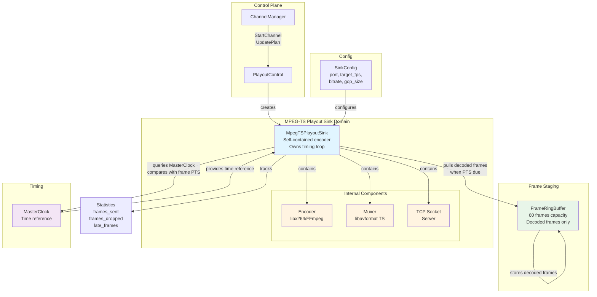

_Related: [Playout Engine Domain](PlayoutEngineDomain.md) • [Video File Producer Domain](VideoFileProducerDomain.md) • [Architecture Overview](../architecture/ArchitectureOverview.md) • [Playout Engine Contract](../contracts/PlayoutEngineContract.md)_

# Domain — MPEG-TS Playout Sink

Status: Enforced

## 1. Overview

The **MPEG-TS Playout Sink** is a self-contained component in the RetroVue Air playout pipeline responsible for consuming decoded, timed frames from the `FrameRingBuffer`, encoding them into an MPEG-TS stream (H.264 + AAC or silent audio), muxing them, and delivering them over a TCP socket to one or more downstream clients (e.g., VLC).

### Purpose

**MpegTSPlayoutSink** is responsible for taking decoded, timed frames from the FrameRingBuffer, encoding them into an MPEG-TS stream (H.264 + AAC or silent audio), muxing them, and delivering them over a TCP socket to one or more downstream clients (e.g., VLC).

It is one implementation of the `IPlayoutSink` abstraction. Future sinks (SDL2 window, file output, RTMP, etc.) will inherit the same interface.

The MPEG-TS Playout Sink exists to:

- **Consume decoded frames**: Read decoded, timed frames from `FrameRingBuffer` when the sink's timing loop determines frame PTS is due
- **Encode frames**: Transform decoded frames into H.264 encoded packets using libx264 or FFmpeg's native H.264 encoder
- **Mux into MPEG-TS**: Package H.264 packets (and optional AAC audio) into MPEG-TS transport stream format using libavformat
- **Stream output**: Deliver MPEG-TS packets over TCP socket to downstream clients
- **MasterClock-driven playout**: Query MasterClock and output frames when PTS is due (sink owns timing loop, MasterClock never pushes ticks)
- **Handle buffer conditions**: Implement buffer underflow/overflow policies (frame freeze, black frame, skip)
- **Provide graceful lifecycle**: Start, stop, and teardown operations that coordinate with the broader channel lifecycle

### Position in Pipeline

```
┌──────────────┐     ┌──────────────┐     ┌──────────────┐     ┌──────────────────────────────┐     ┌──────────────┐
│   Video      │     │    Frame     │     │  MasterClock │     │  MpegTSPlayoutSink            │     │   TCP        │
│   Producer   │────▶│  RingBuffer   │    │              │────▶│  (Encodes + Muxes + Streams)  │────▶│  Socket      │
│  (Decodes)   │     │  (60 frames)  │    │  tick(pts)    │     │                              │     │  (Clients)   │
└──────────────┘     └──────────────┘     └──────────────┘     └──────────────────────────────┘     └──────────────┘
     Source              Staging              Timing Control        Encode Stage (self-contained)         Output
```

The MPEG-TS Playout Sink is a **standalone, self-contained encoder** that sits between the frame staging buffer and the TCP network output. It performs frame encoding, MPEG-TS muxing, and network streaming internally. **Critical**: The sink owns the timing loop - it runs its own worker thread that independently pulls the next decoded frame from the FrameBuffer when the MasterClock indicates that the frame's presentation timestamp (PTS) is due. It does not interact directly with the Producer; frames flow through the buffer.

### Why It Exists

- **Unified responsibility**: Encoding, muxing, and streaming are tightly coupled operations that belong together in a single component
- **Clean module boundary**: Sink has a simple contract: input is decoded Frame objects, output is MPEG-TS stream
- **Thread safety**: Dedicated sink thread prevents blocking the control plane or producer
- **Reusability**: The same sink pattern will support future output types (SDL2WindowSink, MP4FileSink, WebRTCSink, NDISink, etc.) that implement the same `IPlayoutSink` interface
- **Testability**: Stub mode enables testing without real encoding or network dependencies

### Introduction

**MpegTSPlayoutSink** is the first implementation of a playout sink. Its job is to take decoded frames from the FrameRingBuffer and turn them into a live MPEG-TS stream. It is symmetric to producers: producers fill the buffer, sinks drain it.

---

## 1.1. Goals and Non-Goals

### Goals

- **Reliable encoding**: Encode frames consistently into valid H.264 without corruption
- **Predictable performance**: Maintain encoding rate at target FPS with bounded latency
- **Real-time output**: Stream MPEG-TS packets at the correct rate aligned to MasterClock
- **Graceful degradation**: Handle errors (encoding failures, network errors) without crashing
- **Backpressure awareness**: Drop frames when behind schedule to maintain real-time output
- **Lifecycle management**: Support clean start, stop, and teardown operations
- **Self-contained operation**: Perform encoding, muxing, and streaming internally without external encode stages

### Non-Goals

- **Content scheduling**: Does not decide what to play or when (ChannelManager responsibility)
- **Frame decoding**: Does not decode frames (Producer responsibility - frames are already decoded)
- **File management**: Does not manage video files or assets (Producer responsibility)
- **Producer logic**: Does not generate or modify frames (only consumes decoded frames)
- **Audio processing**: Does not encode or process audio tracks (audio is separate responsibility)
- **Subtitle rendering**: Does not encode or render subtitles/captions (separate responsibility)
- **Network protocol negotiation**: Does not handle RTMP, SRT, or other protocols (only UDP/HTTP)
- **Input frame generation**: Does not produce frames (only consumes decoded frames from buffer)

---

## 2. Inheritance Requirement (MANDATORY)

### Interface Inheritance

**MpegTSPlayoutSink MUST inherit from IPlayoutSink.**

This inheritance exists to establish a common interface for all playout sinks, enabling interchangeable sink implementations while maintaining consistent lifecycle and operational guarantees.

### Base Interface: IPlayoutSink

The `IPlayoutSink` interface provides:

- **Lifecycle methods**: `start()`, `stop()`, `isRunning()` for initialization and cleanup
- **Thread ownership**: Each sink manages its own worker thread that owns the timing loop
- **Consistent contract**: All sinks follow the same pattern (own timing loop, query MasterClock, pull frames when PTS due)
- **Event emission**: Optional event callbacks for errors, client connect/disconnect, buffer conditions

### Interface Definition

```cpp
struct IPlayoutSink {
    virtual ~IPlayoutSink() = default;
    
    // Starts the sink (opens socket, initializes encoder/muxer, starts worker thread).
    // Returns true if started successfully, false if already running.
    virtual bool start() = 0;
    
    // Stops the sink gracefully (stops worker thread, closes muxer, encoder, socket).
    virtual void stop() = 0;
    
    // Returns true if sink is currently running.
    virtual bool isRunning() const = 0;
    
    // Optional: sinks may emit events (errors, client connect, disconnect).
    // Events are emitted via callback or event system.
};
```

**Critical Interface Contract**:

Every sink must:
- **Own the timing loop**: Run its own worker thread that continuously checks MasterClock
- **Use master clock–driven playout**: Query MasterClock and compare with frame PTS to determine when to output
- **Consume decoded frames**: Independently pull from FrameRingBuffer when MasterClock indicates frame PTS is due
- **Implement buffer underflow/overflow policies**: Handle empty/full buffer conditions
- **Never block producer**: All buffer operations must be non-blocking

### Inheritance Relationship

```
IPlayoutSink
   ↑
   └── MpegTSPlayoutSink
```

### Future Sink Implementations

Future sinks will implement the same `IPlayoutSink` interface:

- **SDL2WindowSink**: Local preview window (consumes decoded frames, displays via SDL2)
- **MP4FileSink**: File output (consumes decoded frames, writes to MP4 file)
- **WebRTCSink**: WebRTC streaming (consumes decoded frames, streams via WebRTC)
- **HLSSink**: HLS streaming (consumes decoded frames, generates HLS segments)
- **NDISink**: NDI streaming (consumes decoded frames, streams via NDI protocol)
- **PiHDMISink**: Raspberry Pi HDMI output (consumes decoded frames, outputs to HDMI)

All future sinks will:
1. Inherit from `IPlayoutSink`
2. Own the timing loop (run worker thread that continuously checks MasterClock)
3. Consume decoded frames from `FrameRingBuffer` when MasterClock indicates PTS is due
4. Use `MasterClock` as time reference (query MasterClock, compare with frame PTS)
5. Implement the same lifecycle interface (`start()`, `stop()`, `isRunning()`)
6. Report statistics via the common interface

This design enables **interchangeable sinks** via the base interface, allowing the playout engine to switch between output types without changing the core architecture.

---

## 2.1. Input Contract (What the Sink Receives)

The sink reads from the shared `FrameRingBuffer`. Each slot contains decoded frame data with timing metadata.

### Frame Data Structure

```cpp
struct DecodedFrame {
    uint8_t* data;               // Raw frame data (YUV420P planar format)
    int linesize[AV_NUM_DATA_POINTERS];  // Stride for each plane
    int width;                   // Frame width (e.g., 1920)
    int height;                  // Frame height (e.g., 1080)
    AVPixelFormat pix_fmt;      // Pixel format (e.g., AV_PIX_FMT_YUV420P)
    int64_t pts_us;              // Presentation timestamp in microseconds
};
```

**Memory Layout** (YUV420P):
- Y plane: `data[0]`, size = `width × height` bytes
- U plane: `data[1]`, size = `(width/2) × (height/2)` bytes
- V plane: `data[2]`, size = `(width/2) × (height/2)` bytes
- Stride: `linesize[0]`, `linesize[1]`, `linesize[2]` for each plane

### Supported Input Pixel Formats

The sink must accept these formats:

**Required**:
- **YUV420P** (AV_PIX_FMT_YUV420P): Planar YUV 4:2:0 format
  - Most common format from video decoders
  - Directly compatible with H.264 encoder

**Optional** (converted internally):
- **RGBA** (AV_PIX_FMT_RGBA): RGB with alpha channel
  - Converted to YUV420P using libswscale before encoding
  - Used for graphics overlays or generated content

**Future Support** (via libswscale):
- YUV422P, YUV444P, RGB24, etc.
- All formats converted to YUV420P before encoding

**Error Handling**:
- If format is unsupported → `ERROR_UNSUPPORTED_PIXEL_FORMAT`
- Sink logs error and enters fault state
- Sink does not crash or drop frames silently

**Implementation**:
```cpp
if (frame.pix_fmt != AV_PIX_FMT_YUV420P) {
    // Convert using libswscale
    if (!sws_ctx_) {
        sws_ctx_ = sws_getContext(
            frame.width, frame.height, frame.pix_fmt,
            frame.width, frame.height, AV_PIX_FMT_YUV420P,
            SWS_BILINEAR, nullptr, nullptr, nullptr
        );
        if (!sws_ctx_) {
            EmitEvent(SinkEvent::ERROR_UNSUPPORTED_PIXEL_FORMAT);
            return;
        }
    }
    // Convert frame to YUV420P
    sws_scale(sws_ctx_, frame.data, frame.linesize, 0, frame.height,
              yuv420_data, yuv420_linesize);
}
```

---

## 2.2. Output Behavior (What the Sink Produces)

### Output Format

**Container**: MPEG-TS (MPEG Transport Stream)

**Video Codec**: H.264 (libx264 or FFmpeg's native H.264 encoder)

**Audio**: Optional silent audio track (AAC) or no audio

**Transport**: TCP server socket

**Stream URL Example**:
```
tcp://127.0.0.1:9000
```

### TCP Server Behavior

The sink runs a small TCP server:

1. **Listen on port**: `listen(port)` - blocks until client connects
2. **Accept one client**: `accept()` - for simplicity, one client at a time
3. **When client disconnects**:
   - Tear down muxer
   - Wait for new connection (blocking accept)
   - Continue master-clock–driven playout

**Implementation**:
```cpp
void MpegTSPlayoutSink::start() {
    // Open TCP socket
    socket_fd_ = socket(AF_INET, SOCK_STREAM, 0);
    bind(socket_fd_, &addr, sizeof(addr));
    listen(socket_fd_, 1);  // Listen for one client
    
    // Accept client (blocking - may run in separate thread)
    client_fd_ = accept(socket_fd_, nullptr, nullptr);
    client_connected_ = true;
    
    // Initialize encoder and muxer
    InitializeEncoder();
    InitializeMuxer();
}
```

**Client Disconnect Handling**:
```cpp
void HandleClientDisconnect() {
    // Close muxer
    CloseMuxer();
    
    // Close client socket
    close(client_fd_);
    client_connected_ = false;
    
    // Wait for new connection (blocking)
    client_fd_ = accept(socket_fd_, nullptr, nullptr);
    client_connected_ = true;
    
    // Reinitialize muxer for new client
    InitializeMuxer();
}
```

### Blocking vs Nonblocking

**accept()**: May block (acceptable - runs in separate thread or during start)

**write()**: Must NOT block

**Critical Rule**: Network backpressure → frames must be dropped, never delayed

**Rationale**: Blocking writes would break sync — forbidden. If TCP socket buffer is full:
- Drop frame immediately
- Log network backpressure event
- Continue to next frame

**Implementation**:
```cpp
// Set socket to non-blocking
int flags = fcntl(client_fd_, F_GETFL, 0);
fcntl(client_fd_, F_SETFL, flags | O_NONBLOCK);

// Write (non-blocking)
ssize_t written = write(client_fd_, ts_packet, size);
if (written < 0) {
    if (errno == EAGAIN || errno == EWOULDBLOCK) {
        // Socket buffer full - drop frame
        EmitEvent(SinkEvent::NETWORK_BACKPRESSURE);
        frames_dropped_++;
        return;
    }
    // Other error - handle disconnect
    HandleClientDisconnect();
}
```

---

## 3. Domain Responsibilities

### What MpegTSPlayoutSink DOES

- ✅ **Owns the timing loop**: Runs its own worker thread that continuously checks MasterClock against frame PTS
- ✅ **Pulls decoded frames from FrameRingBuffer**: Independently pulls the next decoded frame when MasterClock indicates the frame's PTS is due
- ✅ **Compares MasterClock time against frame PTS**: Continuously compares current MasterClock time against the next frame's PTS to determine when to output
- ✅ **Encodes frames into H.264**: Uses libx264 or FFmpeg to encode decoded YUV420 frames into H.264 NAL units
- ✅ **Muxes into MPEG-TS**: Uses libavformat to package H.264 packets (and optional AAC audio) into MPEG-TS transport stream
- ✅ **Streams over TCP socket**: Sends MPEG-TS packets to TCP client socket (e.g., `tcp://127.0.0.1:9000`)
- ✅ **Handles timing**: When PTS is due (or slightly overdue), pops frame, encodes/muxes it, and emits it into the MPEG-TS stream
- ✅ **Maintains real-time output**: Ensures MPEG-TS stream maintains correct frame rate aligned to MasterClock
- ✅ **Tracks statistics**: Counts frames sent, frames dropped, late frames, encoding errors
- ✅ **Supports graceful teardown**: Closes muxer, encoder, and socket on stop
- ✅ **Handles empty buffer**: Applies underflow policy (frame freeze, black frame, or skip) when buffer is empty
- ✅ **Handles buffer overrun**: Drops late frames immediately when buffer has overflow (no crash)

### What MpegTSPlayoutSink DOES NOT

- ❌ **Schedule content**: Does not decide which frames to play or when (ChannelManager responsibility)
- ❌ **Decode frames**: Does not decode frames (Producer responsibility - frames are already decoded)
- ❌ **Manage channel state**: Does not track channel lifecycle or emit state transitions (PlayoutControl responsibility)
- ❌ **Parse playout plans**: Does not interpret plan handles or resolve asset URIs (ChannelManager responsibility)
- ❌ **Handle network protocols**: Does not support RTMP, SRT, or other protocols (only TCP socket)
- ❌ **Generate graphics**: Does not create lower thirds, bugs, or overlays (Producer responsibility)
- ❌ **Manage multiple assets**: Does not handle playlists or transitions (ChannelManager orchestrates via UpdatePlan)
- ❌ **Emit telemetry**: Does not publish metrics directly (MetricsExporter aggregates from multiple sources)
- ❌ **Produce frames**: Does not generate or modify frames (only consumes decoded frames from buffer)

### Boundary Conditions

The MPEG-TS Playout Sink operates within these boundaries:

- **Input**: Decoded Frame objects (YUV420 format) pulled from `FrameRingBuffer` by sink's timing loop
- **Output**: MPEG-TS transport stream packets sent over TCP socket to connected client
- **Threading**: Sink runs its own worker thread that owns the timing loop
- **Lifecycle**: Managed by ChannelWorker (created on StartChannel, destroyed on StopChannel)
- **Configuration**: Static configuration provided at construction time (no runtime reconfiguration)

---

## 4. Architecture Diagram



### Key Relationships

1. **MpegTSPlayoutSink → Internal Encoder Components** (contains)
   - Sink encapsulates encoder, muxer, and network output
   - All FFmpeg/libx264 operations are internal implementation details
   - Sink exposes only MPEG-TS stream to external components

2. **MpegTSPlayoutSink → FrameRingBuffer** (pulls decoded frames)
   - Sink holds reference to buffer (owned by ChannelWorker)
   - Non-blocking pop operations with decoded frames only
   - Sink waits when buffer is empty

3. **MpegTSPlayoutSink → MasterClock** (timing reference)
   - Sink owns the timing loop and continuously queries MasterClock
   - Sink compares current MasterClock time against next frame's PTS
   - When PTS is due (or slightly overdue), sink pops frame and outputs it
   - Enables deterministic frame output timing

4. **ChannelManager → MpegTSPlayoutSink** (lifecycle control)
   - Creates sink via `StartChannel` gRPC call
   - Updates configuration via `UpdatePlan` (hot-swaps sink)
   - Destroys sink via `StopChannel`

---

## 5. Data Flow

### Step-by-Step Frame Consumption and Encoding

#### Phase 1: Initialization

1. **ChannelManager** calls `StartChannel(channel_id, plan_handle, port)`
2. **PlayoutControl** creates `ChannelWorker` and allocates `FrameRingBuffer` (60 frames)
3. **PlayoutControl** constructs `SinkConfig`:
   ```cpp
   SinkConfig config;
   config.port = 9000;  // TCP port
   config.target_fps = 30.0;
   config.bitrate = 5000000;  // 5 Mbps
   config.gop_size = 30;
   config.stub_mode = false;
   config.enable_audio = false;  // Optional silent AAC audio
   config.underflow_policy = UnderflowPolicy::FRAME_FREEZE;
   ```
4. **PlayoutControl** creates `MpegTSPlayoutSink(config, ring_buffer, master_clock)`
5. **MpegTSPlayoutSink::start()** initializes:
   - Opens TCP socket (`socket()`, `bind()`, `listen()`)
   - Accepts client connection (blocking `accept()` - may run in separate thread)
   - Initializes libx264 or FFmpeg encoder context (H.264 encoding)
   - Configures libavformat TS muxer (MPEG-TS packaging)
   - Prepares encoding pipeline (YUV420 → H.264 → MPEG-TS)
   - Starts worker thread that owns the timing loop

#### Phase 2: Sink Timing Loop (Worker Thread)

**CRITICAL**: The sink owns the timing loop. It runs continuously in a worker thread.

```
┌─────────────────────────────────────────────────────────────┐
│  Sink Worker Thread (WorkerLoop)                            │
│                                                              │
│  Continuous loop:                                            │
│     ↓                                                         │
│  1. Query MasterClock: master_time_us = master_clock_->now_utc_us()
│     ↓                                                         │
│  2. Peek next frame from buffer (non-destructive)            │
│     ↓                                                         │
│  3. If buffer empty:                                          │
│     - Apply underflow policy (frame freeze/black/skip)       │
│     - Emit BUFFER_UNDERFLOW event                            │
│     - Sleep 10ms, continue loop                              │
│     ↓                                                         │
│  4. Compare frame.pts_us with master_time_us:                 │
│     - If frame.pts_us <= master_time_us:                      │
│       → Frame is on time or late - output it                 │
│     - If frame.pts_us > master_time_us:                       │
│       → Frame is early - sleep and check again               │
│     ↓                                                         │
│  5. Pop frame from buffer                                     │
│     ↓                                                         │
│  6. Handle buffer overflow (drop late frames):                │
│     - Drop all frames with pts_us < master_time_us            │
│     ↓                                                         │
│  7. Convert pixel format (if needed):                          │
│     - libswscale: RGBA → YUV420P                             │
│     ↓                                                         │
│  8. Encode frame to H.264:                                    │
│     - FFmpeg or libx264 encoder                              │
│     - Generate H.264 NAL units                                │
│     ↓                                                         │
│  9. Mux to MPEG-TS:                                           │
│     - Package H.264 into MPEG-TS packets                     │
│     - Set PTS from MasterClock (not frame metadata)          │
│     ↓                                                         │
│  10. Send to TCP socket (non-blocking):                      │
│     - write() to client_fd_ (non-blocking)                    │
│     - If EAGAIN/EWOULDBLOCK: drop frame, emit event           │
│     ↓                                                         │
│  11. Update statistics:                                       │
│     - frames_sent_++                                         │
│     - Store last encoded frame (for frame freeze)            │
│     ↓                                                         │
│  12. Sleep 1ms (avoid busy-waiting), continue loop            │
│                                                              │
│  Loop continues until stop_requested_ is true...              │
└─────────────────────────────────────────────────────────────┘
```

#### Phase 3: Frame Production (Producer Thread)

The Producer runs in a separate thread and pushes decoded frames to the same `FrameRingBuffer`:

1. **Producer** calls `FrameRingBuffer->Push(decoded_frame)`
2. **FrameRingBuffer** atomically copies decoded frame from producer to buffer
3. **Sink** pulls decoded frame from buffer (see Phase 2)
4. **Frame memory** is released after sink consumes it

### Data Flow Pipeline

```
FrameRingBuffer (decoded frames)
        ↓
MpegTSPlayoutSink Worker Thread (timing loop)
        ↓ (queries MasterClock, compares with frame PTS)
        ↓ (when PTS due: pop frame)
libswscale (if conversion needed: RGBA → YUV420P)
        ↓
FFmpeg H.264 Encoder (or libx264)
        ↓
MPEG-TS Muxer (libavformat)
        ↓
TCP Socket Writer (non-blocking)
```

**Pipeline Details**:
- **DecodedFrame** → Input from FrameRingBuffer
- **libswscale** → Pixel format conversion (if needed)
- **FFmpeg H.264 Encoder** → Encodes YUV420P to H.264 NAL units
- **MPEG-TS Muxer** → Packages H.264 + optional AAC into MPEG-TS
- **TCP Socket Writer** → Sends MPEG-TS packets to connected client

**Key Responsibilities**:

- **Timing loop ownership**: Sink owns the timing loop that continuously checks MasterClock vs frame PTS
- **Frame selection**: Sink independently pulls frames when MasterClock indicates PTS is due
- **Backpressure handling**: Sink drops frames when behind schedule to maintain real-time output
- **Dropping frames when late**: Sink implements resync policy when frames are too late
- **Encoding performance management**: Sink manages encoder state and bitrate to maintain quality
- **Maintaining real-time output**: Sink ensures MPEG-TS stream maintains correct frame rate

### Frame Structure

Each decoded frame consumed by MpegTSPlayoutSink has this structure:

```cpp
struct Frame {
    FrameMetadata metadata;
    std::vector<uint8_t> data;  // YUV420 planar format (decoded)
    int width;                  // e.g., 1920
    int height;                 // e.g., 1080
};

struct FrameMetadata {
    int64_t pts;                // Presentation timestamp (microseconds)
    int64_t dts;                // Decode timestamp (microseconds)
    double duration;             // Frame duration (seconds, e.g., 0.0333 for 30fps)
    std::string asset_uri;       // Source file path or URI
};
```

**YUV420 Format** (decoded frame data):
- Y plane: `width × height` bytes (luminance)
- U plane: `(width/2) × (height/2)` bytes (chrominance)
- V plane: `(width/2) × (height/2)` bytes (chrominance)
- Total size: `width × height × 1.5` bytes

**Example** (1920×1080 decoded frame):
- Y plane: 2,073,600 bytes
- U plane: 518,400 bytes
- V plane: 518,400 bytes
- Total: 3,110,400 bytes (~2.97 MB per decoded frame)

---

## 5.1. Internal Encoder Subsystem Architecture

The MpegTSPlayoutSink contains a complete encoding subsystem that performs all encoding operations internally. This subsystem consists of three main components:

### Encoder (libx264)

**Purpose**: Encodes decoded YUV420 frames into H.264 NAL units.

**Operations**:
- Initializes x264 encoder context with target bitrate, GOP size, and profile
- Encodes YUV420 frames to H.264 using `x264_encoder_encode()`
- Generates H.264 NAL units (SPS, PPS, IDR, P, B frames)
- Manages encoder state and rate control

**Key Structures**:
- `x264_t*`: Encoder context
- `x264_picture_t`: Input frame (YUV420)
- `x264_nal_t`: Output NAL units (H.264)

**Thread Safety**: All encoder operations run in the sink thread only.

### Muxer (libavformat)

**Purpose**: Packages H.264 packets into MPEG-TS transport stream format.

**Operations**:
- Creates MPEG-TS format context using `avformat_alloc_output_context2()`
- Opens output URL (UDP or HTTP) using `avio_open()`
- Writes MPEG-TS packets using `av_interleaved_write_frame()`
- Manages PTS/DTS mapping for MPEG-TS stream
- Generates PAT/PMT tables for MPEG-TS

**Key Structures**:
- `AVFormatContext`: MPEG-TS format context
- `AVStream`: Video stream information
- `AVPacket`: MPEG-TS packet data

**Error Handling**: Transient mux errors are logged and retried; fatal errors trigger fallback to stub mode.

### Network Output (TCP Socket)

**Purpose**: Sends MPEG-TS packets to TCP client socket.

**Operations**:
- **TCP server**: Opens TCP socket, listens, accepts client connection
- **Non-blocking write**: Sends packets via `write()` (non-blocking)
- Handles network errors gracefully (client disconnect, reconnect)
- Manages socket lifecycle (open, accept, send, close)

**Key Structures**:
- `int listen_fd_`: TCP listen socket file descriptor
- `int client_fd_`: TCP client socket file descriptor (one client at a time)

**Output Format**: Always MPEG-TS transport stream packets, ready for broadcast infrastructure.

**TCP Socket Behavior**:
- Socket is set to non-blocking mode (`O_NONBLOCK`)
- `write()` returns immediately (never blocks)
- If socket buffer is full (`EAGAIN`/`EWOULDBLOCK`): Drop frame, emit backpressure event
- Client disconnect: Tear down muxer, wait for new connection

### Encoder Requirements

**Must pre-allocate encoder context on start()**:
- Encoder context is created once during `start()`
- Encoder context is reused for all frames
- No encoder creation/destruction during frame processing

**Must set encoder parameters**:
- Bitrate: `config.bitrate` (e.g., 5000000 for 5 Mbps)
- GOP size: `config.gop_size` (e.g., 30 for 1 second at 30fps)
- Time base: `1/90000` recommended for MPEG-TS (90kHz clock)
- Pixel format: YUV420P (after conversion if needed)

**Implementation**:
```cpp
void InitializeEncoder() {
    // Pre-allocate encoder context
    encoder_ctx_ = avcodec_alloc_context3(codec_);
    
    encoder_ctx_->bit_rate = config_.bitrate;
    encoder_ctx_->gop_size = config_.gop_size;
    encoder_ctx_->time_base = {1, 90000};  // 90kHz for MPEG-TS
    encoder_ctx_->pix_fmt = AV_PIX_FMT_YUV420P;
    encoder_ctx_->width = frame_width_;
    encoder_ctx_->height = frame_height_;
    
    avcodec_open2(encoder_ctx_, codec_, nullptr);
}
```

### Muxer Requirements

**Must use avformat_alloc_output_context2(AVFMT_TS)**:
- Create MPEG-TS format context
- Set format to MPEG-TS transport stream

**Must add streams**:
- H.264 video stream (required)
- Optional AAC audio stream (if `config.enable_audio`)

**Must set AVFMT_FLAG_NONBLOCK**:
- Muxer operations must not block
- Critical for real-time output

**Implementation**:
```cpp
void InitializeMuxer() {
    // Allocate MPEG-TS format context
    avformat_alloc_output_context2(&format_ctx_, nullptr, "mpegts", nullptr);
    
    // Set non-blocking flag
    format_ctx_->flags |= AVFMT_FLAG_NONBLOCK;
    
    // Add video stream
    video_stream_ = avformat_new_stream(format_ctx_, encoder_);
    video_stream_->codecpar->codec_id = AV_CODEC_ID_H264;
    
    // Add audio stream (optional)
    if (config_.enable_audio) {
        audio_stream_ = avformat_new_stream(format_ctx_, audio_codec_);
        audio_stream_->codecpar->codec_id = AV_CODEC_ID_AAC;
    }
    
    // Open output (TCP socket)
    avio_open2(&format_ctx_->pb, output_url, AVIO_FLAG_WRITE, nullptr, nullptr);
    
    // Write header
    avformat_write_header(format_ctx_, nullptr);
}
```

### Encoding Determinism Rules

The encoder must produce deterministic, broadcast-compliant output. These rules ensure consistent behavior and compatibility with downstream equipment.

#### No B-Frames

**Rule**: Encoder MUST NOT produce B-frames (bidirectional predicted frames).

**Rationale**:
- B-frames require out-of-order encoding and decoding
- B-frames complicate PTS/DTS mapping
- B-frames increase latency
- Broadcast equipment may not handle B-frames correctly

**Implementation**:
```cpp
x264_param_t param;
x264_param_default_preset(&param, "veryfast", "zerolatency");
param.i_bframe = 0;  // No B-frames
param.i_bframe_adaptive = X264_B_ADAPT_NONE;
```

**Verification**:
- Encoded stream must contain only I-frames (IDR) and P-frames
- No B-frames in encoded bitstream (verify via libavcodec analysis)

#### PTS Based on MasterClock, Not Producer Metadata

**Rule**: Encoder PTS MUST be calculated from MasterClock, not from producer frame metadata.

**Rationale**:
- Producer PTS may drift or be incorrect
- MasterClock is authoritative timing source
- Broadcast timing must align to MasterClock

**Implementation**:
```cpp
// WRONG: Use producer PTS directly
int64_t pts = frame.metadata.pts;  // Don't do this!

// CORRECT: Calculate PTS from MasterClock
int64_t scheduled_utc = master_clock_->scheduled_to_utc_us(frame.metadata.pts);
int64_t encoder_pts = (scheduled_utc - epoch_utc_) / 1000;  // Convert to milliseconds
```

**PTS Calculation**:
1. Query MasterClock: `scheduled_utc = master_clock_->scheduled_to_utc_us(frame.metadata.pts)`
2. Convert to encoder timebase: `encoder_pts = (scheduled_utc - epoch_utc_) / timebase`
3. Set encoder PTS: `x264_picture_t.pts = encoder_pts`

**Verification**:
- Encoded stream PTS must match MasterClock deadlines (within tolerance)
- Encoded stream PTS must be monotonically increasing

#### GOP Structure Fixed

**Rule**: GOP (Group of Pictures) structure MUST be fixed and deterministic.

**Configuration**:
- GOP size: `config.gop_size` (default: 30 frames = 1 second at 30fps)
- IDR interval: Every `gop_size` frames
- No adaptive GOP sizing
- No scene change detection

**Implementation**:
```cpp
x264_param_t param;
param.i_keyint_max = config.gop_size;  // IDR every GOP
param.i_keyint_min = config.gop_size;  // Fixed GOP
param.b_intra_refresh = 0;  // No adaptive refresh
```

**GOP Pattern**:
- Frame 0: IDR (I-frame)
- Frames 1-29: P-frames
- Frame 30: IDR (I-frame)
- Repeat pattern

**Verification**:
- IDR frames appear exactly every `gop_size` frames
- No adaptive GOP changes
- GOP structure is consistent throughout stream

#### SPS/PPS Cadence

**Rule**: SPS (Sequence Parameter Set) and PPS (Picture Parameter Set) MUST be sent at least every keyframe.

**Rationale**:
- SPS/PPS required for decoder initialization
- SPS/PPS must be available for stream switching
- Broadcast equipment requires frequent SPS/PPS

**Implementation**:
```cpp
x264_param_t param;
param.b_repeat_headers = 1;  // Repeat SPS/PPS every IDR
param.b_annexb = 1;  // Annex-B format (includes SPS/PPS)
```

**Cadence**:
- SPS/PPS sent with every IDR frame
- SPS/PPS sent at stream start
- SPS/PPS sent after encoder reset

**Verification**:
- Every IDR frame must contain SPS/PPS
- Stream must be decodable from any IDR frame
- SPS/PPS must be valid (parsable by libavcodec)

#### Strict CBR or Capped VBR

**Rule**: Encoder MUST use strict CBR (Constant Bitrate) or capped VBR (Variable Bitrate with maximum cap).

**Rationale**:
- Broadcast infrastructure requires predictable bitrate
- Network bandwidth must be bounded
- Downstream equipment may not handle variable bitrate

**CBR Mode** (Recommended):
```cpp
x264_param_t param;
param.rc.i_rc_method = X264_RC_ABR;  // Average bitrate
param.rc.i_bitrate = config.bitrate;  // Target bitrate
param.rc.i_vbv_max_bitrate = config.bitrate;  // Max bitrate = target
param.rc.i_vbv_buffer_size = config.bitrate;  // Buffer = bitrate
param.rc.b_strict_abr = 1;  // Strict CBR
```

**Capped VBR Mode** (Alternative):
```cpp
x264_param_t param;
param.rc.i_rc_method = X264_RC_ABR;
param.rc.i_bitrate = config.bitrate;
param.rc.i_vbv_max_bitrate = config.bitrate * 1.1;  // 10% cap above target
param.rc.i_vbv_buffer_size = config.bitrate;
param.rc.b_strict_abr = 0;  // Allow some variation
```

**Bitrate Compliance**:
- Actual bitrate must be within ±10% of target bitrate (averaged over 1 second)
- Peak bitrate must not exceed `max_bitrate` (for capped VBR)
- Bitrate must be stable (no sudden spikes or drops)

**Verification**:
- Measure encoded bitrate over 10-second window
- Verify bitrate within ±10% of target
- Verify no bitrate spikes > 20% above target

---

## 5.2. Frame Buffer Interaction

The `FrameRingBuffer` is a lock-free circular buffer that stages decoded frames between the producer (decode thread) and sink (sink thread).

### Buffer Architecture

**Design**:
- Fixed capacity: 60 frames (default, configurable)
- Lock-free: Uses atomic read/write indices
- Single producer, single consumer: Thread-safe for this pattern
- Non-blocking: `Push()` and `Pop()` return immediately with success/failure

**Memory Layout**:
```
FrameRingBuffer (capacity = 60)
┌─────────────────────────────────────────┐
│ [0] [1] [2] ... [58] [59]               │  ← Frame slots
│  ↑                    ↑                 │
│ read_index         write_index          │  ← Atomic indices
└─────────────────────────────────────────┘
```

### Sink → Buffer Interaction

**Pop Operation** (`FrameRingBuffer::Pop()`):
1. Sink thread calls `Pop(decoded_frame)`
2. Buffer checks if data available: `read_index != write_index`
3. If empty: Returns `false` immediately (non-blocking)
4. If data available:
   - Copies `Frame` object from buffer slot at `read_index` to sink
   - Atomically updates `read_index` (release memory order)
   - Returns `true`

**Empty Buffer Handling**:
- When `Pop()` returns `false` (buffer empty):
  - Sink increments `buffer_empty_count_` statistic
  - Sink waits 10ms (`kSinkWaitUs`)
  - Sink retries pop on next iteration
  - Sink never blocks waiting for buffer data

**Frame Ownership**:
- Buffer owns frame until `Pop()` succeeds
- After successful pop, sink owns the frame
- Frame memory is released after encoding completes

### Producer → Buffer Interaction

**Push Operation** (`FrameRingBuffer::Push()`):
1. Producer thread calls `Push(decoded_frame)`
2. Buffer checks if space available: `(write_index + 1) % capacity != read_index`
3. If full: Returns `false` immediately (non-blocking)
4. If space available:
   - Copies `Frame` object into buffer slot at `write_index`
   - Atomically updates `write_index` (release memory order)
   - Returns `true`

**Buffer Depth Management**:
- **Target depth**: 30-45 frames (1-1.5 seconds at 30fps)
- **Minimum depth**: 10 frames (triggers buffering state)
- **Maximum depth**: 60 frames (triggers backpressure)

### Ring Buffer Policy

The ring buffer policy ensures that sink and producer never block each other, and that the sink maintains real-time output by dropping frames when necessary.

#### Sink Never Blocks Producer

**Rule**: Sink MUST never block the producer thread.

**Mechanism**:
- Sink uses non-blocking `Pop()` operation
- If buffer is empty: Sink waits 10ms and retries (does not block)
- Producer can always push frames (buffer has capacity)

**Implementation**:
- `FrameRingBuffer::Pop()` returns `false` immediately if buffer is empty
- Sink handles empty buffer by waiting and retrying (see Behavior for Empty Buffer)
- Producer never waits for sink to consume frames

**Verification**:
- Producer push operations never block
- Producer thread never waits on sink operations
- Buffer full condition is handled by producer (backpressure)

#### Producer Never Blocks Sink

**Rule**: Producer MUST never block the sink thread.

**Mechanism**:
- Producer uses non-blocking `Push()` operation
- If buffer is full: Producer backs off 10ms and retries (does not block)
- Sink can always pop frames (buffer has data)

**Implementation**:
- `FrameRingBuffer::Push()` returns `false` immediately if buffer is full
- Producer handles full buffer by backing off and retrying (see VideoFileProducerDomain.md)
- Sink never waits for producer to push frames

**Verification**:
- Sink pop operations never block
- Sink thread never waits on producer operations
- Buffer empty condition is handled by sink (waiting)

#### Sink Must Drop if Behind by > X Frames

**Rule**: Sink MUST drop frames when behind schedule by more than threshold.

**Threshold**: 2 frames (66ms at 30fps)

**Conditions**:
- Sink is behind schedule: `gap_us < -kLateThresholdUs` (33ms)
- Buffer depth > 10 frames (sufficient depth for dropping)
- Sink has dropped > 2 consecutive frames

**Actions**:
1. Calculate frames behind: `frames_behind = -gap_us / frame_interval_us`
2. If `frames_behind > 2`: Enter aggressive drop mode
3. Drop all frames until within 1 frame of schedule
4. Log warning: `"[MpegTSPlayoutSink] Dropping <N> frames: <frames_behind> frames behind"`

**Implementation**:
```cpp
int64_t frame_interval_us = 1'000'000 / config_.target_fps;  // 33ms at 30fps
int frames_behind = (-gap_us) / frame_interval_us;

if (frames_behind > 2 && buffer_.Size() > kMinDepthForDrop) {
    int frames_to_drop = frames_behind - 1;  // Drop to 1 frame behind
    LogWarning("Dropping %d frames: %d frames behind", frames_to_drop, frames_behind);
    
    for (int i = 0; i < frames_to_drop && buffer_.Size() > kMinDepthForDrop; i++) {
        Frame frame;
        if (!buffer_.Pop(frame)) break;
        frames_dropped_++;
    }
}
```

#### Sink Must Log Desync Event if Behind by > Y ms

**Rule**: Sink MUST log desync event when behind schedule by more than threshold.

**Threshold**: 50ms

**Conditions**:
- Sink is behind schedule: `gap_us < -50'000` (50ms)
- This is a desync event (not just a late frame)

**Actions**:
1. Log desync event: `"[MpegTSPlayoutSink] Desync event: <gap_ms>ms behind schedule"`
2. Increment `desync_events_` counter
3. Emit desync event to metrics system
4. If desync persists > 100ms: Trigger hard desync (see Hard Desync Threshold)

**Implementation**:
```cpp
constexpr int64_t kDesyncThresholdUs = 50'000;  // 50ms

if (gap_us < -kDesyncThresholdUs) {
    LogWarning("Desync event: %ld ms behind schedule", -gap_us / 1000);
    desync_events_++;
    EmitDesyncEvent(-gap_us / 1000);  // Emit to metrics
    
    if (gap_us < -kHardDesyncThresholdUs) {  // 100ms
        // Trigger hard desync handling
        HandleHardDesync();
    }
}
```

#### Sink Must Soft-Wait if Ahead by > Z ms

**Rule**: Sink MUST sleep (soft-wait) when ahead of schedule by more than threshold.

**Threshold**: 5ms

**Conditions**:
- Sink is ahead of schedule: `gap_us > 5'000` (5ms)
- Frame deadline is in the future

**Actions**:
1. Calculate wait time: `wait_us = gap_us - kWaitFudgeUs` (wake up slightly before deadline)
2. Sleep until deadline: `WaitUntilUtc(master_clock_, deadline_utc - kWaitFudgeUs)`
3. Fine-grained spin-wait for last < 1ms
4. Output frame at exact deadline

**Implementation**:
```cpp
constexpr int64_t kSoftWaitThresholdUs = 5'000;  // 5ms
constexpr int64_t kWaitFudgeUs = 500;  // 500µs

if (gap_us > kSoftWaitThresholdUs) {
    int64_t target_utc = deadline_utc - kWaitFudgeUs;
    WaitUntilUtc(master_clock_, target_utc);
    
    // Fine-grained spin-wait for last < 1ms
    while (master_clock_->now_utc_us() < deadline_utc) {
        int64_t remaining_us = deadline_utc - master_clock_->now_utc_us();
        if (remaining_us > 1'000) {  // > 1ms
            WaitForMicros(master_clock_, remaining_us / 2);
        }
        // Spin for < 1ms
    }
}
```

**Rationale**:
- Prevents outputting frames too early (causes jitter)
- Maintains precise timing alignment
- Reduces CPU usage (sleep instead of busy-wait)

---

## 5.3. Threading Model

**CRITICAL**: The sink owns the timing loop and runs its own worker thread.

**Threading Architecture**:
- **Sink Worker Thread** → Owns timing loop, continuously checks MasterClock vs frame PTS
- **Producer Thread** → Fills FrameRingBuffer (separate thread)
- **Client Accept Thread** → Handles TCP client connect/disconnect (optional, separate)

**Threading Architecture**:
```
Sink Worker Thread
    ↓ (timing loop: continuously running)
    Check MasterClock time
    ↓
    Compare with next frame PTS
    ↓
    If PTS due: Pop frame, encode, send
    ↓ (encodes and sends frame)
TCP Socket Write (non-blocking)

Producer Thread (separate)
    ↓ (pushes frames)
FrameRingBuffer

Client Accept Thread (optional, separate)
    ↓ (handles client connect/disconnect)
TCP Socket Accept
```

**Key Point**: The sink worker thread independently pulls frames when MasterClock indicates the frame's PTS is due. The sink does not wait for external calls - it actively monitors timing.

### Timing Loop-Based Frame Processing

**Sink Owns the Timing Loop**:

The sink runs its own worker thread with a continuous timing loop that checks MasterClock against frame PTS.

**Frame Processing Path** (Timing Loop → `EncodeAndSendFrame()`):

1. **Timing Check** (in worker loop):
   ```cpp
   // Continuously running loop
   while (!stop_requested_) {
       // Query MasterClock for current time
       int64_t master_time_us = master_clock_->now_utc_us();
       
       // Peek next frame (non-destructive)
       DecodedFrame* next_frame = buffer_.Peek();
       
       if (next_frame && next_frame->pts_us <= master_time_us) {
           // Frame PTS is due (or overdue) - pop and output
           DecodedFrame frame;
           buffer_.Pop(frame);
           EncodeAndSendFrame(frame, master_time_us);
       } else if (!next_frame) {
           // Buffer empty - apply underflow policy
           HandleBufferUnderflow(master_time_us);
       }
       
       // Small sleep to avoid busy-waiting (e.g., 1ms)
       std::this_thread::sleep_for(std::chrono::microseconds(1000));
   }
   ```

2. **Pixel Format Conversion** (if needed):
   ```cpp
   if (frame.pix_fmt != AV_PIX_FMT_YUV420P) {
       sws_scale(sws_ctx_, frame.data, frame.linesize, 0, frame.height,
                 yuv420_data, yuv420_linesize);
   }
   ```

3. **Encode Frame**:
   ```cpp
   x264_picture_t pic_in;
   // Fill pic_in with YUV420 data
   x264_nal_t* nals;
   int i_nals;
   x264_encoder_encode(encoder_, &nals, &i_nals, &pic_in, &pic_out);
   ```

4. **Mux to MPEG-TS**:
   ```cpp
   AVPacket pkt;
   // Convert H.264 NAL units to AVPacket
   av_interleaved_write_frame(format_ctx_, &pkt);
   ```

5. **Send to TCP Socket** (non-blocking):
   ```cpp
   ssize_t written = write(client_fd_, ts_packet, size);
   if (written < 0 && (errno == EAGAIN || errno == EWOULDBLOCK)) {
       // Socket buffer full - drop frame
       EmitEvent(SinkEvent::NETWORK_BACKPRESSURE);
       frames_dropped_++;
   }
   ```

6. **Update Statistics**:
   ```cpp
   frames_sent_++;
   last_encoded_frame_ = encoded_frame;  // Store for frame freeze
   ```

---

## 6. Timing & Scheduling

### 6.1 High-Level Timing Model

The **MpegTSPlayoutSink** owns its own timing loop and is the authority on *when* frames are encoded and sent. It:

- Runs a dedicated **worker thread** that:
  - pulls time from `MasterClock` (`now_utc_us()`)
  - decides when each frame is due
  - pulls frames from the `FrameRingBuffer`
  - encodes and muxes them into an MPEG-TS stream

- Treats `MasterClock` as a read-only station clock:
  - **MasterClock never pushes ticks or callbacks**
  - The sink calls `master_clock_->now_utc_us()` whenever it needs the current station time

The goal is: **frames come out of the sink in real time, aligned to MasterClock, according to their media PTS.**

### 6.2 Mapping Media PTS to Station Time

The sink receives decoded frames from `FrameRingBuffer` where:

- `frame.metadata.pts` is in **microseconds**, starting at or near 0 for the first frame
- PTS is **monotonically increasing** within one asset (guaranteed by VideoFileProducer contract)

The sink maps media PTS to station (wall) time using a simple affine transform:

- On the first frame it accepts for playout, it computes:

  ```cpp
  pts_zero_utc_us = master_clock_->now_utc_us() - frame.metadata.pts
  ```

- For any subsequent frame with `pts`, the target station time is:

  ```cpp
  target_utc_us = pts_zero_utc_us + frame.metadata.pts
  ```

This keeps media time and station time locked together:

- If MasterClock jumps forward, playout sinks will naturally catch up
- If decode stalls and a frame arrives late, the sink can detect "we are late" by comparing `now_utc_us` to `target_utc_us`

### 6.3 Worker Loop States

The worker thread of MpegTSPlayoutSink operates with the following states (see **FE-012: Error → Sink Status Mapping** for detailed status behavior):

- **Idle** – not started; no frames are pulled
- **Running** – main timing loop active; sink is operating normally (may have recoverable errors)
- **Degraded** – sink is operating but experiencing degraded-mode errors (sustained starvation, repeated late frames)
- **Stopping** – graceful shutdown requested; sink drains buffers and terminates
- **Faulted** – unrecoverable error (encoder/muxer failure, corrupted frame memory); sink stops output (see **FE-020: Fault Mode Behavior & Latching**)

**Transitions**:
- `Idle → Running` when `Start()` is called and encoder/muxer are initialized
- `Running → Degraded` when degraded-mode errors are encountered (sustained starvation, repeated late frames)
- `Running → Stopping` when `RequestStop()` is called
- `Running → Faulted` when unrecoverable errors occur (encoder/muxer failure, corrupted memory)
- `Degraded → Running` when degraded conditions clear (if recovery rules allow)
- `Degraded → Faulted` when degraded conditions escalate to unrecoverable errors
- `Stopping → Idle` when worker thread exits cleanly
- `Faulted → Idle` only via explicit reset or full teardown + re-instantiation (fault latching - see FE-020)

**Note**: Status elevation follows strict rules (FE-012): once elevated to `Faulted`, status cannot silently clear without explicit reset. `Degraded` status may return to `Running` if recovery conditions are met.

### 6.4 Main Timing Loop (Conceptual)

The main loop for `Running` is:

1. **Read current time from MasterClock**:

   ```cpp
   now = master_clock_->now_utc_us()
   ```

2. **If there is no "current frame" loaded, attempt to pop one from the FrameRingBuffer**:

   - If a frame is available:
     - If this is the first frame, compute `pts_zero_utc_us` as described above
     - Compute `target_utc_us = pts_zero_utc_us + frame.pts`
   - If the buffer is empty:
     - Record a buffer underrun
     - Sleep for a small backoff (e.g. 2–5 ms) and retry

3. **Decide what to do with the current frame**:

   - **On-time or early**:

     ```cpp
     if now < target_utc_us:
         sleep until target_utc_us (clamped to a small minimum granularity)
         now = master_clock_->now_utc_us()
     ```
     Then encode and send the frame.

   - **Slightly late (within tolerance)**:

     ```cpp
     lateness = now - target_utc_us
     if 0 <= lateness <= kMaxLateToleranceUs:
         encode and send the frame immediately
     ```

   - **Very late (beyond tolerance)**:

     ```cpp
     if lateness > kMaxLateToleranceUs:
         drop the frame, count a "late drop", and pull the next frame
         recompute its target time and repeat the decision
     ```

4. **After encoding and muxing the frame, clear the "current frame" and go back to step 1.**

This loop continues until:
- `Stop()` is requested, or
- an unrecoverable encoder/muxer error occurs

### 6.5 Underrun and Overrun Behavior

The sink must handle buffer edge conditions explicitly:

**Buffer Underrun (no frames available when we need one)**:
- Increment `stats.buffer_underruns`
- Do not attempt to synthesize frames in the sink
- Sleep a short backoff (2–5 ms) and retry
- If underrun persists beyond a configurable threshold, log a warning

**Buffer Overrun (frames so late we must drop them)**:
- When `now - target_utc_us > kMaxLateToleranceUs`, the frame is considered too late
- Increment `stats.late_frame_drops`
- Drop the frame without encoding/muxing it
- Pull the next frame and evaluate again

**Typical values**:
- `kMaxLateToleranceUs ≈ 1.5 * frame_duration_us` (e.g. ~50 ms at 30 fps)
- Underrun backoff: 2–5 ms

### 6.6 Alignment with MasterClock

The sink must only obtain time from MasterClock:

- It must not call `std::chrono::steady_clock::now()` or similar directly
- All "what time is it?" decisions flow through `master_clock_->now_utc_us()`
- Sleep/wait primitives (e.g. `std::this_thread::sleep_for`) use durations derived from MasterClock deltas

This guarantees that:
- All channels and sinks share a single station time base
- Test code can use a fake MasterClock to simulate time progress deterministically

### 6.7 Interaction with Producer and Buffer

The timing contract between producer and sink is:

- Producer tries to keep the `FrameRingBuffer` filled (depth ≈ 1–2 seconds of video)
- Sink pops frames at real-time pace determined by MasterClock and frame PTS
- If producer is faster, buffer fills and producer sees backpressure (already covered by VideoFileProducer contract)
- If producer is slower, buffer empties and sink sees underruns (as defined above)

The sink does not try to adjust decode rate or manipulate the producer. It only:

- Observes buffer depth indirectly (empty vs non-empty)
- Observes frame PTS and MasterClock to decide when to output
- Emits statistics on underruns and late drops for higher-level orchestration to react to

---

## 7. Interfaces and Contracts

### MpegTSPlayoutSink Public API

```cpp
class MpegTSPlayoutSink : public IPlayoutSink {
public:
    // Constructs sink with configuration and input buffer.
    MpegTSPlayoutSink(
        const SinkConfig& config,
        buffer::FrameRingBuffer& input_buffer,
        std::shared_ptr<timing::MasterClock> master_clock
    );
    
    // Starts the sink (opens socket, initializes encoder/muxer, starts worker thread).
    // Returns true if started successfully, false if already running.
    bool start() override;
    
    // Stops the sink gracefully (stops worker thread, closes muxer, encoder, socket).
    void stop() override;
    
    // Returns true if sink is currently running.
    bool isRunning() const override;
    
    // Optional: Set event callback for sink events.
    void setEventCallback(std::function<void(SinkEvent, int64_t, int64_t)> callback);
    
    // Statistics (optional, may be part of IPlayoutSink or separate interface)
    uint64_t getFramesSent() const;
    uint64_t getFramesDropped() const;
    uint64_t getEncodingErrors() const;
    uint64_t getNetworkErrors() const;
    uint64_t getBufferEmptyCount() const;
};
```

**Lifecycle Contract**:
- `start()` can only be called when not running (returns false if already running)
- `start()` blocks on `accept()` until client connects (may run in separate thread)
- `start()` starts the worker thread that owns the timing loop
- `stop()` stops the worker thread and closes all resources gracefully (safe to call from any thread)
- Worker thread continuously runs timing loop until `stop()` is called
- Destructor automatically calls `stop()` if sink is still running

### SinkConfig Structure

```cpp
struct SinkConfig {
    int port;                    // TCP port (e.g., 9000)
    double target_fps;           // Target frame rate (e.g., 30.0)
    int bitrate;                 // Encoding bitrate (e.g., 5000000 for 5 Mbps)
    int gop_size;                // GOP size (e.g., 30 for 1 second at 30fps)
    bool stub_mode;              // Use stub mode (no real encoding)
    UnderflowPolicy underflow_policy;  // FRAME_FREEZE, BLACK_FRAME, or SKIP
    bool enable_audio;           // Enable silent AAC audio track
};
```

### Frame Object Shape

**Required Fields** (decoded frame):
- `frame.data`: Non-empty vector<uint8_t> containing YUV420 planar data (decoded)
- `frame.width`: Positive integer (e.g., 1920)
- `frame.height`: Positive integer (e.g., 1080)
- `frame.metadata.pts`: Monotonically increasing int64_t (microseconds)
- `frame.metadata.dts`: int64_t ≤ pts (microseconds)
- `frame.metadata.duration`: Positive double (seconds)

**Invariants**:
- `frame.data.size() == width * height * 1.5` (YUV420 decoded format)
- `pts` must increase within a single asset stream
- `duration` must match `1.0 / target_fps` (approximately)
- Frame data is always decoded (never encoded packets)

### Error Events

The MpegTSPlayoutSink handles error conditions according to **FE-005: Error Detection and Classification**. Errors are classified into three categories:

#### Recoverable Errors

These errors increment counters but do not force a state transition. Sink remains in `Running` status:

1. **Late frames** (within discardable threshold):
   - Increments `stats.late_frames`
   - Frames are dropped but sink continues

2. **Temporary upstream starvation**:
   - Increments `stats.buffer_underruns`
   - Sink waits and retries (see FE-006)

3. **Transient encoding errors** (single frame failure):
   - Logs error: `"Encoding errors: N"`
   - Increments `stats.encoding_errors`
   - Skips frame and continues (allows recovery)

4. **Transient network errors** (single send failure):
   - Logs error: `"Network errors: N"`
   - Increments `stats.network_errors`
   - Retries send with backoff
   - Does not stop sink (allows recovery)

#### Degraded-Mode Errors

These errors elevate status to `Degraded` but output remains valid:

1. **Sustained starvation** (above threshold, e.g., > 500ms):
   - Increments `stats.buffer_underruns`
   - Status elevates to `Degraded`
   - Output remains valid MPEG-TS

2. **Repeated late frames** (beyond discard window):
   - Increments `stats.late_frames` and `stats.frames_dropped`
   - Status elevates to `Degraded`
   - Output remains valid MPEG-TS

3. **Buffer overrun/underrun during steady load**:
   - Status elevates to `Degraded`
   - Upstream should be alerted

#### Fault / Unrecoverable Errors

These errors elevate status to `Faulted` and halt output (see **FE-020: Fault Mode Behavior & Latching**):

1. **Encoder initialization failure** (cannot fall back to stub):
   - Logs error: `"Failed to initialize encoder"`
   - Status elevates to `Faulted`
   - Sink halts output

2. **Corrupted frame memory**:
   - Status elevates to `Faulted`
   - Sink halts output

3. **Repeated internal exceptions**:
   - Status elevates to `Faulted`
   - Sink halts output

4. **TS muxer producing invalid packets**:
   - Status elevates to `Faulted`
   - Sink halts output

**Fault Latching** (FE-020): Once status is `Faulted`, it remains latched until:
- Explicit `reset()` API call (if implemented), or
- Full teardown + re-instantiation of sink object

**Error Classification** (FE-005): All errors must be detected, classified, and logged. Recoverable errors must not cause sink fault. Unrecoverable errors must not be ignored.

### Lifecycle Events

The sink emits these lifecycle events (via logging, not callbacks):

- **Started**: `"[MpegTSPlayoutSink] Started for output: <uri>"`
- **Stopped**: `"[MpegTSPlayoutSink] Stopped. Total frames sent: <count>"`
- **Teardown requested**: `"[MpegTSPlayoutSink] Teardown requested (timeout=<ms>)"`
- **Buffer drained**: `"[MpegTSPlayoutSink] Buffer drained; completing teardown"`
- **Sink loop exited**: `"[MpegTSPlayoutSink] Sink loop exited"`

**Note**: The sink does not emit gRPC events or metrics directly. The `MetricsExporter` aggregates statistics from multiple sources.

---

## 7.1. Teardown Rules

Teardown is the graceful shutdown procedure that ensures all frames are processed and resources are cleaned up properly. These rules define the exact behavior during teardown.

### Max Drain Timeout

**Rule**: Teardown MUST complete within maximum drain timeout.

**Default Timeout**: 3 seconds

**Configuration**:
```cpp
constexpr std::chrono::milliseconds kMaxDrainTimeout{3000};  // 3 seconds
```

**Behavior**:
1. `RequestTeardown(drain_timeout)` is called
2. Sink stops consuming new frames
3. Sink waits for buffer to drain (producer may still push frames)
4. If buffer drains before timeout: Teardown completes successfully
5. If timeout is reached: Force stop (see Force Stop Rules)

**Implementation**:
```cpp
void RequestTeardown(std::chrono::milliseconds drain_timeout) {
    teardown_requested_ = true;
    teardown_timeout_ = drain_timeout;
    teardown_start_time_ = std::chrono::steady_clock::now();
}

// In sink loop
if (teardown_requested_) {
    if (buffer_.IsEmpty()) {
        // Buffer drained, complete teardown
        break;
    }
    
    auto elapsed = std::chrono::steady_clock::now() - teardown_start_time_;
    if (elapsed > teardown_timeout_) {
        LogWarning("Teardown timeout reached; forcing stop");
        ForceStop();
        break;
    }
    
    // Continue waiting for buffer to drain
    WaitForMicros(master_clock_, kSinkWaitUs);
}
```

**Timeout Limits**:
- Minimum timeout: 500ms (too short may cause frame drops)
- Maximum timeout: 10 seconds (too long may cause hang)
- Recommended timeout: 3 seconds (balance between safety and responsiveness)

### Flush Encoder or Not

**Rule**: Encoder MUST be flushed during teardown to ensure all frames are encoded.

**Flush Policy**: **Flush encoder** (default)

**Rationale**:
- Encoder may have buffered frames that need to be encoded
- Flushing ensures all frames are sent to output
- Prevents frame loss during teardown

**Implementation**:
```cpp
void FlushEncoder() {
    // Flush encoder (encode any buffered frames)
    x264_nal_t* nals;
    int i_nals;
    
    // Send NULL frame to flush encoder
    while (x264_encoder_encode(encoder_, &nals, &i_nals, nullptr, &pic_out) >= 0) {
        if (i_nals > 0) {
            // Mux and send flushed frames
            MuxAndSendNals(nals, i_nals);
        }
    }
}
```

**Teardown Sequence**:
1. Stop consuming new frames (`teardown_requested_ = true`)
2. Wait for buffer to drain
3. When buffer is empty: Flush encoder
4. Flush muxer (write any buffered MPEG-TS packets)
5. Complete teardown

**Alternative**: Skip flush (faster teardown, may drop frames)
- Only used if `drain_timeout` is very short (< 500ms)
- Encoder buffers are discarded
- May result in frame loss

### Close Mux Gracefully or Force-Close

**Rule**: Muxer MUST be closed gracefully to ensure MPEG-TS stream is properly terminated.

**Close Policy**: **Graceful close** (default)

**Rationale**:
- MPEG-TS stream must be properly terminated
- Graceful close writes final PAT/PMT tables
- Force-close may corrupt stream

**Graceful Close**:
```cpp
void CloseMuxerGracefully() {
    // Write trailer (final PAT/PMT tables)
    av_write_trailer(format_ctx_);
    
    // Close output
    if (format_ctx_->pb) {
        avio_closep(&format_ctx_->pb);
    }
    
    // Free format context
    avformat_free_context(format_ctx_);
    format_ctx_ = nullptr;
}
```

**Force-Close** (only on timeout):
```cpp
void ForceCloseMuxer() {
    // Close output immediately (may not write trailer)
    if (format_ctx_->pb) {
        avio_closep(&format_ctx_->pb);
    }
    
    // Free format context
    avformat_free_context(format_ctx_);
    format_ctx_ = nullptr;
}
```

**Teardown Sequence**:
1. Flush encoder (if enabled)
2. Flush muxer buffers
3. Write MPEG-TS trailer (`av_write_trailer()`)
4. Close output (`avio_closep()`)
5. Free format context (`avformat_free_context()`)

**Exception**:
- If teardown timeout is reached: Force-close muxer (skip trailer)
- This prevents hang if muxer is stuck

### Destroy Sink Thread Deterministically

**Rule**: Sink thread MUST be destroyed deterministically within timeout.

**Thread Destruction Sequence**:
1. Set `stop_requested_ = true`
2. Wait for sink loop to exit (with timeout)
3. If thread does not exit: Force thread termination
4. Join thread (ensure thread is destroyed)

**Implementation**:
```cpp
void Stop() {
    if (!is_running_) {
        return;  // Already stopped
    }
    
    // Signal stop
    stop_requested_ = true;
    
    // Wait for thread to exit (with timeout)
    auto start = std::chrono::steady_clock::now();
    while (sink_thread_.joinable()) {
        auto elapsed = std::chrono::steady_clock::now() - start;
        if (elapsed > std::chrono::seconds(5)) {
            LogError("Sink thread did not exit within 5 seconds; forcing termination");
            // Thread will be joined in destructor
            break;
        }
        std::this_thread::sleep_for(std::chrono::milliseconds(10));
    }
    
    // Join thread
    if (sink_thread_.joinable()) {
        sink_thread_.join();
    }
    
    is_running_ = false;
}
```

**Timeout**:
- Maximum wait time: 5 seconds
- If thread does not exit: Log error and continue (thread will be joined in destructor)
- Destructor MUST join thread (prevents resource leak)

**Thread Safety**:
- `Stop()` can be called from any thread
- `Stop()` blocks until thread exits (or timeout)
- Multiple calls to `Stop()` are safe (idempotent)

**Destructor Behavior**:
```cpp
~MpegTSPlayoutSink() {
    if (is_running_) {
        Stop();  // Ensure thread is stopped
    }
    
    // Cleanup resources
    if (encoder_) {
        x264_encoder_close(encoder_);
    }
    if (format_ctx_) {
        ForceCloseMuxer();  // Force close in destructor
    }
}
```

### Teardown State Machine

```
RUNNING
   ↓ (RequestTeardown())
TEARDOWN_REQUESTED
   ↓ (buffer empty)
DRAINING
   ↓ (flush encoder)
FLUSHING
   ↓ (close muxer)
CLOSING
   ↓ (thread exit)
STOPPED
```

**States**:
- **TEARDOWN_REQUESTED**: Teardown initiated, waiting for buffer to drain
- **DRAINING**: Buffer is draining, waiting for empty
- **FLUSHING**: Buffer empty, flushing encoder
- **CLOSING**: Encoder flushed, closing muxer
- **STOPPED**: Teardown complete, thread exited

**Timeout Handling**:
- If any state exceeds timeout: Force stop immediately
- Force stop skips flushing and graceful close
- Thread is terminated deterministically

---

## 8. Contracts

This section provides a high-level overview of the functional expectations for the MPEG-TS Playout Sink. **For detailed contract definitions, test criteria, and pass/fail conditions, see [MpegTSPlayoutSinkDomainContract.md](../contracts/MpegTSPlayoutSinkDomainContract.md)**.

The MPEG-TS Playout Sink implements **FE-001 through FE-023** functional expectations, covering:

- **Lifecycle Management** (FE-001): Start, stop, and teardown operations
- **Frame Consumption** (FE-002): FIFO frame pulling and PTS monotonicity
- **Timing Control** (FE-003): MasterClock-driven playout timing
- **Encoding** (FE-004, FE-013): Valid H.264 encoding of decoded frames
- **Error Handling** (FE-005, FE-012): Error detection, classification, and status mapping
- **Buffer Management** (FE-006, FE-007): Empty buffer and overrun handling
- **Statistics** (FE-008): Accurate reporting of operational metrics
- **Network I/O** (FE-009, FE-010, FE-011): Nonblocking writes, queue overflow, client disconnect
- **Stream Validation** (FE-014, FE-015, FE-016): PTS monotonicity, FFprobe readability, timing preservation
- **Timing Compliance** (FE-017, FE-018, FE-019): Real-time stability, PTS/DTS integrity, PCR cadence
- **Fault Management** (FE-020): Fault latching and isolation
- **Resilience** (FE-021, FE-022, FE-023): Encoder stall recovery, queue invariants, TS packet alignment

### FE-001: Sink Starts and Stops Correctly

**Rule**: Sink must support clean start, stop, and teardown operations.

**Expected Behavior**:
- Sink initializes in stopped state with zero frames sent
- `Start()` returns true on first call, false if already running
- `Stop()` blocks until sink thread exits (no hanging threads)
- `Stop()` is idempotent (safe to call multiple times)
- Destructor automatically stops sink if still running

**Test Criteria**:
- ✅ Construction: `IsRunning() == false`, `GetFramesSent() == 0`
- ✅ Start: `Start() == true`, `IsRunning() == true`
- ✅ Start twice: Second `Start()` returns false
- ✅ Stop: `Stop()` blocks until thread exits, `IsRunning() == false`
- ✅ Stop idempotent: Multiple `Stop()` calls are safe
- ✅ Destructor: Sink stops automatically on destruction

---

### FE-002: Pulls Frames in Order

**Rule**: Sink must pull decoded frames from buffer in order (FIFO).

**Expected Behavior**:
- Sink pops frames from buffer in the order they were pushed
- Sink maintains frame order through encoding and output
- Sink does not skip frames unless they are late (see PS-003)
- Frame PTS values increase monotonically in output stream

**Test Criteria**:
- ✅ Frame order: Frames are output in the same order as pushed to buffer
- ✅ PTS monotonicity: Output frame PTS values increase monotonically
- ✅ No frame reordering: Sink does not reorder frames during encoding

---

### FE-003: Obeys Master Clock

**Rule**: Sink must query MasterClock and output frames at the correct time.

**Expected Behavior**:
- Sink queries `MasterClock::scheduled_to_utc_us()` for each frame
- Sink sleeps when ahead of schedule (waits until deadline)
- Sink drops frames when behind schedule (more than threshold late)
- Sink maintains real-time output pacing aligned to MasterClock

**Test Criteria**:
- ✅ Clock query: Sink queries MasterClock before each frame output
- ✅ Ahead of schedule: Sink sleeps when frame deadline is in future
- ✅ Behind schedule: Sink drops frames when frame deadline is in past
- ✅ Timing accuracy: Frame output timing matches MasterClock deadlines (conforms to FE-017 jitter/drift bounds)

---

### FE-004: Encodes Valid H.264 Frames

**Rule**: Sink must encode decoded frames into valid H.264 NAL units.

**Expected Behavior**:
- Encoder produces valid H.264 NAL units (SPS, PPS, IDR, P, B frames)
- Encoder maintains encoder state correctly (reference frames, GOP structure)
- Encoded bitstream is decodable by standard H.264 decoders
- Encoder respects bitrate and GOP size configuration

**Test Criteria**:
- ✅ Valid H.264: Encoded output is valid H.264 bitstream (parsable by libavcodec)
- ✅ SPS/PPS: Encoder generates SPS/PPS when needed (IDR frames)
- ✅ Decodable: Encoded frames can be decoded back to YUV420 (round-trip test)
- ✅ Bitrate compliance: Encoded bitrate matches configuration (within 10% tolerance)

---

### FE-015: Output Is Readable by FFprobe (Playable MPEG-TS Stream)

**Rule**: Sink must produce a playable MPEG-TS stream that can be verified in VLC.

**Expected Behavior**:
- Muxer packages H.264 packets into valid MPEG-TS transport stream
- MPEG-TS stream contains PAT/PMT tables
- MPEG-TS stream has correct PTS/DTS mapping
- Stream is playable in VLC media player
- Stream maintains correct frame rate for broadcast

**Test Criteria**:
- ✅ Valid MPEG-TS: Output stream is valid MPEG-TS format (parsable by libavformat)
- ✅ PAT/PMT: Stream contains Program Association Table and Program Map Table
- ✅ VLC playback: Stream plays correctly in VLC (no artifacts, correct frame rate)
- ✅ Frame rate: Stream maintains target frame rate (30fps for 30fps target)

---

### FE-006: Handles Empty Buffer (Waits, No Crash)

**Rule**: Sink must handle empty buffer gracefully by waiting, not crashing.

**Expected Behavior**:
- When `FrameRingBuffer->Pop()` returns false (buffer empty):
  - Sink increments `buffer_empty_count_` statistic
  - Sink waits 10ms (`kSinkWaitUs`)
  - Sink retries pop on next iteration
- Sink never crashes or throws exception on empty buffer
- Sink resumes normal operation when buffer has frames

**Test Criteria**:
- ✅ Empty buffer detection: `GetBufferEmptyCount() > 0` when buffer is empty
- ✅ Wait timing: Sink waits ~10ms before retry (within 2ms tolerance)
- ✅ No crash: Sink does not crash or throw exception on empty buffer
- ✅ Recovery: Sink resumes frame consumption when buffer has frames

---

### FE-007: Handles Buffer Overrun (Drops, No Crash)

**Rule**: Sink must handle buffer overrun gracefully by dropping late frames, not crashing.

**Expected Behavior**:
- When sink is behind schedule (frames are late):
  - Sink drops late frames (more than `kLateThresholdUs` late)
  - Sink increments `frames_dropped_` and `late_frames_` counters
  - Sink continues to next frame (attempts to catch up)
- Sink never crashes or throws exception on buffer overrun
- Sink maintains real-time output (no buffering of late frames)

**Test Criteria**:
- ✅ Late frame detection: Sink detects when frames are late (deadline in past)
- ✅ Frame dropping: Sink drops late frames when behind schedule
- ✅ Statistics tracking: `GetFramesDropped()` and `GetLateFrames()` increment correctly
- ✅ No crash: Sink does not crash or throw exception on buffer overrun
- ✅ Real-time output: Sink maintains real-time output pacing (no buffering)

---

### FE-008: Properly Reports Stats (Frames Sent, Frames Dropped, Late Frames)

**Rule**: Sink statistics must accurately reflect operational state.

**Expected Behavior**:
- `GetFramesSent()`: Counts only successfully sent frames
- `GetFramesDropped()`: Counts frames dropped due to lateness
- `GetLateFrames()`: Counts late frame events
- `GetEncodingErrors()`: Counts encoding failures
- `GetNetworkErrors()`: Counts network send failures
- `GetBufferEmptyCount()`: Counts buffer empty events
- Statistics are updated atomically (thread-safe)
- Statistics are safe to read from any thread

**Test Criteria**:
- ✅ Frame counting: `GetFramesSent()` matches actual frames sent to output
- ✅ Drop tracking: `GetFramesDropped()` increments on each late frame drop
- ✅ Late frame tracking: `GetLateFrames()` increments on each late frame event
- ✅ Error tracking: `GetEncodingErrors()` and `GetNetworkErrors()` track failures
- ✅ Thread safety: Statistics can be read from any thread without race conditions
- ✅ Accuracy: Statistics reflect actual operational state

---

**Note**: The above contracts (FE-001 through FE-008, FE-015) provide high-level summaries. For complete contract definitions including all 23 functional expectations (FE-001 through FE-023), detailed test criteria, pass/fail conditions, and test file references, see **[MpegTSPlayoutSinkDomainContract.md](../contracts/MpegTSPlayoutSinkDomainContract.md)**.

---

## 9. Future Sinks (Guaranteed Compatibility)

Because the `IPlayoutSink` abstraction is solid and well-defined, the following sinks become trivial to implement. All future sinks will inherit from `IPlayoutSink` and follow the same callback-based pattern.

### SDL2PlayoutSink

**Purpose**: Local preview window for debugging and monitoring.

**Implementation**:
- Owns timing loop (worker thread continuously checks MasterClock vs frame PTS)
- Consumes decoded frames from `FrameRingBuffer` when PTS is due
- Converts YUV → texture using SDL2
- Renders texture to window using `RenderCopy()`
- Uses MasterClock as time reference (may also use vsync for smooth display)
- Implements `IPlayoutSink` interface

**Key Point**: SDL2PlayoutSink owns timing loop, consumes decoded frames, and displays them directly (no encoding needed).

### FileRecorderSink

**Purpose**: File output for recording and archiving.

**Implementation**:
- Owns timing loop (worker thread continuously checks MasterClock vs frame PTS)
- Consumes decoded frames from `FrameRingBuffer` when PTS is due
- Encodes frames to H.264 (libx264 or FFmpeg)
- Muxes to MP4 file (libavformat) instead of MPEG-TS
- Writes to local file system
- Implements `IPlayoutSink` interface

**Key Point**: FileRecorderSink owns timing loop and performs encoding/muxing similar to MpegTSPlayoutSink, but outputs to file instead of TCP socket.

### RTMPPlayoutSink

**Purpose**: RTMP streaming for broadcast platforms.

**Implementation**:
- Owns timing loop (worker thread continuously checks MasterClock vs frame PTS)
- Consumes decoded frames from `FrameRingBuffer` when PTS is due
- Encodes frames to H.264 (libx264 or FFmpeg)
- Swaps muxer to RTMP format (libavformat RTMP)
- Swaps network transport to RTMP protocol
- Implements `IPlayoutSink` interface

**Key Point**: RTMPPlayoutSink owns timing loop and is nearly identical to MpegTSPlayoutSink - only the muxer and network transport differ.

### WebRTCSink

**Purpose**: WebRTC streaming for web-based playback.

**Implementation**:
- Owns timing loop (worker thread continuously checks MasterClock vs frame PTS)
- Consumes decoded frames from `FrameRingBuffer` when PTS is due
- Encodes frames to H.264/VP8/VP9 (libx264/libvpx)
- Packages into WebRTC RTP packets
- Streams via WebRTC protocol
- Implements `IPlayoutSink` interface

**Key Point**: WebRTCSink owns timing loop and performs encoding/streaming, but uses WebRTC protocol instead of MPEG-TS.

### RawYUVSink

**Purpose**: Dump raw frames to disk for analysis.

**Implementation**:
- Owns timing loop (worker thread continuously checks MasterClock vs frame PTS)
- Consumes decoded frames from `FrameRingBuffer` when PTS is due
- Writes raw YUV420P frames directly to disk (no encoding)
- Simple file I/O (no muxer needed)
- Implements `IPlayoutSink` interface

**Key Point**: RawYUVSink owns timing loop and is the simplest sink - just dumps frames to disk when PTS is due.

### HLSSink

**Purpose**: HLS streaming for adaptive bitrate playback.

**Implementation**:
- Consumes decoded frames from `FrameRingBuffer`
- Encodes frames to H.264 (multiple bitrates)
- Generates HLS segments (.ts files)
- Creates HLS playlist (.m3u8)
- Serves via HTTP
- Implements `IPlayoutSink` interface

**Key Point**: HLSSink performs encoding and segment generation, outputting HLS format instead of continuous MPEG-TS stream.

### NDISink

**Purpose**: NDI streaming for professional video production.

**Implementation**:
- Consumes decoded frames from `FrameRingBuffer`
- Encodes frames to NDI format (NDI SDK)
- Streams via NDI protocol
- Implements `IPlayoutSink` interface

**Key Point**: NDISink uses NDI SDK for encoding and streaming, following the same consumption pattern.

### PiHDMISink

**Purpose**: Raspberry Pi HDMI output for direct display.

**Implementation**:
- Consumes decoded frames from `FrameRingBuffer`
- Converts YUV420 to RGB (if needed)
- Outputs directly to Raspberry Pi HDMI
- Uses Pi-specific hardware acceleration
- Implements `IPlayoutSink` interface

**Key Point**: PiHDMISink consumes decoded frames and outputs directly to HDMI (no encoding needed, but may require format conversion).

### Common Pattern

All future sinks will:

1. **Inherit from IPlayoutSink**: Common interface for lifecycle
2. **Own the timing loop**: All sinks run worker thread that continuously checks MasterClock
3. **Consume decoded frames**: All sinks independently pull from `FrameRingBuffer` when MasterClock indicates PTS is due (decoded frames only)
4. **Use MasterClock as time reference**: All sinks query MasterClock and compare with frame PTS to determine when to output
5. **Implement same lifecycle**: `start()`, `stop()`, `isRunning()` methods
6. **Never block producer**: All buffer operations must be non-blocking
7. **Implement buffer policies**: All sinks handle underflow/overflow conditions
8. **Emit events**: All sinks emit events for errors, buffer conditions, etc.

**Architectural Consistency**: This unified model ensures that:
- MpegTSPlayoutSink owns timing loop, consumes decoded frames, outputs MPEG-TS
- SDL2PlayoutSink owns timing loop, consumes decoded frames, displays them
- FileRecorderSink owns timing loop, consumes decoded frames, writes to file
- RTMPPlayoutSink owns timing loop, consumes decoded frames, streams via RTMP
- WebRTCSink owns timing loop, consumes decoded frames, streams via WebRTC
- All sinks implement `IPlayoutSink` interface
- All sinks own their timing loop and query MasterClock independently
- All sinks can be hot-swapped without changing core architecture

**Domain Document Generality**: The domain doc must be general enough to allow interchangeable sinks via the base interface. This means:
- Domain doc describes sink responsibilities (own timing loop, query MasterClock, pull frames when PTS due)
- Domain doc focuses on `IPlayoutSink` interface and timing loop pattern, not specific sink types
- Domain doc enables future sinks to follow the same pattern (own timing loop, use MasterClock as reference)
- Domain doc supports hot-swapping of sink implementations

---

## 10. Completion Criteria

This domain document will drive the creation of:

1. **IPlayoutSink Interface**: Base interface defining common sink contract
   - Lifecycle methods: `Start()`, `Stop()`, `IsRunning()`
   - Statistics methods: `GetFramesSent()`, `GetFramesDropped()`, `GetLateFrames()`
   - Thread ownership and lifecycle guarantees

2. **MpegTSPlayoutSink Implementation**: Concrete sink implementation
   - Inherits from `IPlayoutSink`
   - Implements frame consumption from `FrameRingBuffer`
   - Implements H.264 encoding (libx264)
   - Implements MPEG-TS muxing (libavformat)
   - Implements UDP/HTTP streaming
   - Uses MasterClock for timing decisions

3. **Playout Sink Contract Tests**: Test suite verifying sink contracts
   - PS-001: Sink starts and stops correctly
   - PS-002: Pulls frames in order
   - PS-003: Obeys master clock
   - PS-004: Encodes valid H.264 frames
   - PS-005: Produces playable MPEG-TS stream verified in VLC
   - PS-006: Handles empty buffer (waits, no crash)
   - PS-007: Handles buffer overrun (drops, no crash)
   - PS-008: Properly reports stats (frames sent, frames dropped, late frames)

**Cursor will generate scaffolding based on this document.**

The scaffolding will include:
- `IPlayoutSink` interface definition
- `MpegTSPlayoutSink` class skeleton
- Contract test framework
- Integration with `FrameRingBuffer` and `MasterClock`
- Statistics tracking infrastructure

---

## 11. Known Constraints

### Current Limitations

1. **UDP/HTTP only**: 
   - Supports UDP and HTTP output protocols
   - Does not support RTMP, SRT, or other streaming protocols
   - Does not support multicast UDP (unicast only)

2. **Single output per sink**:
   - One sink streams to one output URI
   - No multi-cast or fan-out support
   - ChannelManager must create multiple sinks for multiple outputs

3. **Fixed encoding parameters**:
   - Bitrate, GOP size, and profile are set at construction time
   - No dynamic bitrate adaptation during operation
   - No adaptive streaming (single bitrate output)

4. **H.264 only**:
   - Output codec is always H.264 (libx264)
   - No HEVC, VP9, or other codec support
   - Renderer must handle H.264 (or transcode)

5. **No audio**:
   - Video-only encoding (audio streams are ignored)
   - Audio handling is separate responsibility (if needed)

6. **No subtitle/caption support**:
   - Subtitle tracks are ignored
   - Caption encoding is separate responsibility

7. **Hot-swap limitation**:
   - `UpdatePlan` stops and restarts sink (brief interruption)
   - No seamless transition between output configurations
   - Buffer is cleared on plan update

8. **Error recovery**:
   - Encoding errors cause frame skip and retry (may drop frames)
   - Network errors cause retry with backoff (may drop frames)
   - No automatic retry of entire stream on fatal errors
   - Channel enters `error` state on persistent failures

### Assumptions

1. **Frame availability**: Decoded frames are available in buffer at correct rate
2. **Codec support**: System has libx264 and libavformat available
3. **Network connectivity**: Output URI is reachable (UDP/HTTP endpoint)
4. **Frame rate**: Frames arrive at consistent frame rate (variable frame rate may cause timing issues)
5. **Memory**: System has sufficient RAM for encoder buffers and MPEG-TS muxing
6. **CPU**: Encoder thread can keep up with target_fps (hardware acceleration recommended for 4K)

---

## 12. Anti-patterns / What NOT to Do

### ❌ Do NOT Block on Buffer Pop

**Anti-pattern**:
```cpp
// WRONG: Blocking pop will deadlock if buffer is empty
while (!buffer.Pop(frame)) {
    // Infinite loop - sink thread hangs
}
```

**Correct pattern**:
```cpp
// CORRECT: Non-blocking pop with wait
if (!buffer.Pop(frame)) {
    buffer_empty_count_++;
    WaitForMicros(master_clock_, kSinkWaitUs);  // Wait 10ms
    // Retry on next iteration
}
```

**Why**: The sink thread must never block waiting for buffer data. Empty buffer is handled by waiting and retrying, allowing the producer to catch up.

### ❌ Do NOT Access FFmpeg/libx264 APIs Directly from External Components

**Anti-pattern**:
```cpp
// WRONG: External component directly uses libx264
x264_t* encoder = x264_encoder_open(...);
// External component is tightly coupled to libx264
```

**Correct pattern**:
```cpp
// CORRECT: libx264 is internal to MpegTSPlayoutSink
// External components only interact with IPlayoutSink API
auto sink = std::make_unique<MpegTSPlayoutSink>(config, buffer, clock);
// libx264 operations are encapsulated inside sink
```

**Why**: libx264 and FFmpeg operations are internal implementation details of MpegTSPlayoutSink. External components should only interact with the sink's public API.

### ❌ Do NOT Emit Metrics or gRPC Events

**Anti-pattern**:
```cpp
// WRONG: Sink directly emits metrics
metrics_exporter_->SubmitChannelMetrics(channel_id, metrics);
// Sink is coupled to telemetry system
```

**Correct pattern**:
```cpp
// CORRECT: Sink only tracks internal statistics
frames_sent_++;
frames_dropped_++;
// MetricsExporter reads statistics via GetFramesSent()
```

**Why**: The sink should be a pure encode/stream component. Telemetry aggregation is handled by `MetricsExporter`, which reads sink statistics via public getters.

### ❌ Do NOT Parse Playout Plans

**Anti-pattern**:
```cpp
// WRONG: Sink interprets plan handles
Plan plan = ParsePlanHandle(plan_handle);
std::string output_uri = plan.GetOutputURI();
// Sink is coupled to plan format
```

**Correct pattern**:
```cpp
// CORRECT: Sink receives resolved output URI
SinkConfig config;
config.output_uri = output_uri;  // Already resolved by ChannelManager
// Sink treats output_uri as opaque string
```

**Why**: The sink should not know about playout plans or scheduling logic. The ChannelManager resolves plan handles to output URIs before creating the sink.

### ❌ Do NOT Manage Channel State

**Anti-pattern**:
```cpp
// WRONG: Sink transitions channel state
if (buffer.Size() < 10) {
    channel_state_ = ChannelState::BUFFERING;
    EmitStateTransition(channel_id, channel_state_);
}
// Sink is coupled to channel lifecycle
```

**Correct pattern**:
```cpp
// CORRECT: Sink only tracks internal state
bool is_running_ = true;
// OrchestrationLoop monitors buffer depth and transitions channel state
```

**Why**: Channel state management is the responsibility of `PlayoutControl` and `OrchestrationLoop`. The sink only tracks whether it is running or stopped.

### ❌ Do NOT Use Blocking I/O in Sink Thread

**Anti-pattern**:
```cpp
// WRONG: Blocking network I/O in sink thread
send(socket_fd, data, size, 0);  // Blocks if network is slow
// Sink thread hangs, frames stop flowing
```

**Correct pattern**:
```cpp
// CORRECT: Non-blocking or async network I/O
// Use non-blocking sockets or async I/O
// Sink thread maintains real-time output
```

**Why**: The sink thread must maintain real-time frame output. Blocking I/O operations will cause frame drops and buffer underruns.

### ❌ Do NOT Skip Timing Checks

**Anti-pattern**:
```cpp
// WRONG: Ignore MasterClock timing
Frame frame;
buffer.Pop(frame);
EncodeAndSendFrame(frame);  // No timing check!
// Frames output at wrong rate, broadcast timing is wrong
```

**Correct pattern**:
```cpp
// CORRECT: Query MasterClock before each frame
int64_t deadline_utc = master_clock_->scheduled_to_utc_us(frame.metadata.pts);
int64_t now_utc = master_clock_->now_utc_us();
if (now_utc < deadline_utc) {
    WaitUntilUtc(master_clock_, deadline_utc);
}
EncodeAndSendFrame(frame);
```

**Why**: Ignoring MasterClock timing leads to incorrect broadcast timing, frame rate issues, and synchronization problems. The sink must query MasterClock before each frame output.

### ❌ Do NOT Start Sink Multiple Times

**Anti-pattern**:
```cpp
// WRONG: Start sink without checking state
sink.Start();  // First call
sink.Start();  // Second call - creates duplicate thread!
// Two sink threads compete for same buffer
```

**Correct pattern**:
```cpp
// CORRECT: Check state before starting
if (!sink.IsRunning()) {
    sink.Start();
}
// Or use the return value
if (!sink.Start()) {
    // Already running, handle error
}
```

**Why**: Starting a sink multiple times creates duplicate sink threads that compete for the same buffer, causing race conditions and frame corruption.

### ❌ Do NOT Modify Configuration After Construction

**Anti-pattern**:
```cpp
// WRONG: Change config while sink is running
sink.config_.bitrate = 10000000;  // Sink already started!
// Sink behavior changes mid-operation, causing encoding issues
```

**Correct pattern**:
```cpp
// CORRECT: Configuration is immutable after construction
SinkConfig config;
config.bitrate = 10000000;
auto sink = std::make_unique<MpegTSPlayoutSink>(config, buffer, clock);
// Config is frozen at construction time
```

**Why**: Configuration changes during operation cause unpredictable behavior (bitrate changes, encoding parameter mismatches). To change configuration, stop the sink, create a new one with new config, and start it.

### ❌ Do NOT Access Buffer from Multiple Threads

**Anti-pattern**:
```cpp
// WRONG: Multiple threads pop from same buffer
std::thread sink1([&]() { buffer.Pop(frame1); });
std::thread sink2([&]() { buffer.Pop(frame2); });
// FrameRingBuffer is single-consumer, causes race conditions
```

**Correct pattern**:
```cpp
// CORRECT: One sink thread per buffer
// Sink thread: pops decoded frames
// Producer thread: pushes decoded frames
// No other threads access buffer
```

**Why**: `FrameRingBuffer` is designed for single-producer, single-consumer use. Multiple consumers cause race conditions and frame corruption.

---

## 13. Glossary

**Frame**  
A single decoded video frame containing raw pixel data (YUV420 format) and timing metadata (PTS, DTS, duration). Frames are the atomic unit of data flowing through the playout pipeline. All frames in FrameRingBuffer are decoded and ready for encoding.

**Sink**  
A component that consumes decoded frames from a `FrameRingBuffer` and outputs them in a specific format (MPEG-TS, file, display, etc.). The MpegTSPlayoutSink is a specialization that encodes frames and streams them as MPEG-TS. Future sinks (SDL2WindowSink, MP4FileSink) will also consume decoded frames and output them in different formats.

**Pipeline**  
The end-to-end data flow from source (video file) through decode (Producer) and staging (FrameRingBuffer) to output (Sink). The pipeline ensures decoded frames flow at the correct rate with proper timing.

**Producer**  
The component that generates decoded frames and pushes them into a `FrameRingBuffer`. The VideoFileProducer is a specialization that reads video files and decodes them internally. Producers fill the buffer.

**Playout**  
The overall process of decoding scheduled content and delivering it as a broadcast stream. The RetroVue Air playout engine orchestrates multiple channels, each with its own producer, buffer, and sink.

**FrameRingBuffer**  
A lock-free circular buffer that stages decoded frames between the producer (decode thread) and sink (sink thread). Default capacity is 60 frames (2 seconds at 30 fps). Contains only decoded frames, never encoded packets.

**MasterClock**  
The authoritative timing source from RetroVue Core that ensures all channels remain synchronized. The MpegTSPlayoutSink uses MasterClock to determine when each frame should be output, ensuring broadcast timing accuracy.

**PTS (Presentation Timestamp)**  
The timestamp indicating when a frame should be displayed/broadcast. Extracted from video file packet timestamps by the Producer and converted to microseconds. Must be monotonically increasing within a single asset.

**DTS (Decode Timestamp)**  
The timestamp indicating when a frame should be decoded. May be less than PTS for B-frames (out-of-order decode). Currently set equal to PTS in the implementation.

**Backpressure**  
The condition when the downstream buffer is full and the producer cannot push more decoded frames. The Producer handles backpressure by backing off (waiting 10ms) and retrying.

**Teardown**  
A graceful shutdown procedure where the sink stops consuming new decoded frames and waits for the buffer to drain before exiting. Used during channel transitions to avoid dropping frames.

**Internal Encoder Subsystem**  
The libx264 and FFmpeg-based components (encoder, muxer, network output) that are encapsulated inside MpegTSPlayoutSink. These are implementation details; external components only see MPEG-TS stream output.

**IPlayoutSink**  
The base interface for all playout sinks. Defines common lifecycle methods (Start, Stop, IsRunning) and statistics methods (GetFramesSent, GetFramesDropped, GetLateFrames). All sinks inherit from this interface.

---

## See Also

- [Playout Engine Domain](PlayoutEngineDomain.md) — Overall channel architecture
- [Video File Producer Domain](VideoFileProducerDomain.md) — Frame production and decoding
- [Architecture Overview](../architecture/ArchitectureOverview.md) — System-wide architecture
- [Playout Engine Contract](../contracts/PlayoutEngineContract.md) — Behavioral guarantees
- [GLOSSARY.md](../GLOSSARY.md) — Additional terminology

---

## Design Notes (2025)

### Architectural Pattern

This document establishes the **Sink Pattern** for RetroVue Air playout:

**Core Rule**: A Sink in RetroVue consumes *decoded frames* from FrameRingBuffer and outputs them in a specific format (MPEG-TS, file, display, etc.). A Sink does *not* decode frames; frames are already decoded when consumed.

### Key Design Decisions

1. **Unified Sink Model**: MpegTSPlayoutSink performs encoding, muxing, and streaming internally. There is no separate encoder stage in the pipeline. Instead, MpegTSPlayoutSink *contains* the encoding subsystem internally.

2. **Decoded Frames Only**: FrameRingBuffer explicitly contains only decoded frames. Sinks consume decoded frames and transform them into output format (MPEG-TS, file, display).

3. **Simplified Pipeline**: The pipeline is now simpler and more object-oriented:
   - Input: decoded Frame objects from FrameRingBuffer
   - MpegTSPlayoutSink: consumes decoded frames + encodes internally → outputs MPEG-TS stream
   - FrameRingBuffer: stores decoded frames
   - Producer: generates decoded frames (never encoded packets)

4. **Future Sinks**: Future sinks (SDL2WindowSink, MP4FileSink, etc.) will NOT need decoding — they will simply consume already-decoded frames and output them in different formats. This reinforces why decoding belongs in Producers, not Sinks.

5. **Interface Inheritance**: All sinks inherit from `IPlayoutSink`, enabling interchangeable sink implementations and hot-swapping without changing core architecture.

### Benefits

- **Cleaner Architecture**: Clear separation of concerns with Sinks handling all encoding/output internally
- **Simplified Pipeline**: No separate encode stage simplifies the system
- **Consistent Pattern**: All sinks follow the same pattern (consume decoded frames, output in specific format)
- **Better Encapsulation**: Encoding operations are internal implementation details
- **Interchangeable Sinks**: Base interface enables hot-swapping of sink implementations

